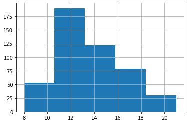
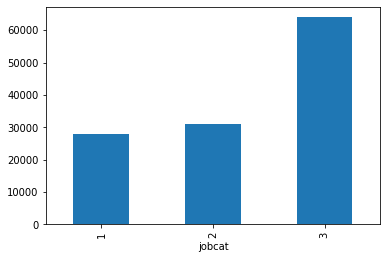
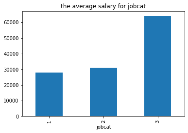
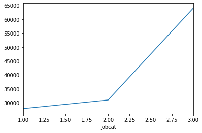
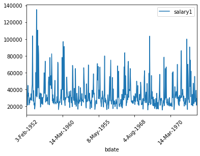
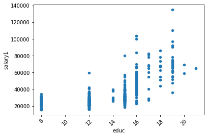
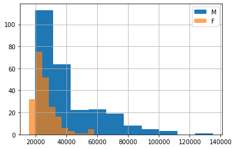
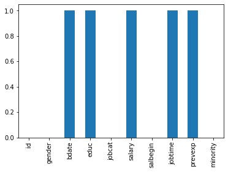

```python
import pandas as pd
```

# Transforming data


```python
df = pd.read_csv("Employee data.csv")
```


```python
df.info()
```

    <class 'pandas.core.frame.DataFrame'>
    RangeIndex: 474 entries, 0 to 473
    Data columns (total 10 columns):
    id          474 non-null int64
    gender      474 non-null object
    bdate       474 non-null object
    educ        474 non-null int64
    jobcat      474 non-null int64
    salary      474 non-null object
    salbegin    474 non-null object
    jobtime     474 non-null int64
    prevexp     474 non-null int64
    minority    474 non-null int64
    dtypes: int64(6), object(4)
    memory usage: 37.1+ KB


```python
df.shape
```


    (474, 10)


```python
#print(df)
df.head()
```


<div>
<style scoped>
    .dataframe tbody tr th:only-of-type {
        vertical-align: middle;
    }

    .dataframe tbody tr th {
        vertical-align: top;
    }

    .dataframe thead th {
        text-align: right;
    }
</style>
<table border="1" class="dataframe">
  <thead>
    <tr style="text-align: right;">
      <th></th>
      <th>id</th>
      <th>gender</th>
      <th>bdate</th>
      <th>educ</th>
      <th>jobcat</th>
      <th>salary</th>
      <th>salbegin</th>
      <th>jobtime</th>
      <th>prevexp</th>
      <th>minority</th>
    </tr>
  </thead>
  <tbody>
    <tr>
      <th>0</th>
      <td>1</td>
      <td>m</td>
      <td>3-Feb-1952</td>
      <td>15</td>
      <td>3</td>
      <td>$57,000</td>
      <td>$27,000</td>
      <td>98</td>
      <td>144</td>
      <td>0</td>
    </tr>
    <tr>
      <th>1</th>
      <td>2</td>
      <td>m</td>
      <td>23-May-1958</td>
      <td>16</td>
      <td>1</td>
      <td>$40,200</td>
      <td>$18,750</td>
      <td>98</td>
      <td>36</td>
      <td>0</td>
    </tr>
    <tr>
      <th>2</th>
      <td>3</td>
      <td>f</td>
      <td>26-Jul-1929</td>
      <td>12</td>
      <td>1</td>
      <td>$21,450</td>
      <td>$12,000</td>
      <td>98</td>
      <td>381</td>
      <td>0</td>
    </tr>
    <tr>
      <th>3</th>
      <td>4</td>
      <td>f</td>
      <td>15-Apr-1947</td>
      <td>8</td>
      <td>1</td>
      <td>$21,900</td>
      <td>$13,200</td>
      <td>98</td>
      <td>190</td>
      <td>0</td>
    </tr>
    <tr>
      <th>4</th>
      <td>5</td>
      <td>m</td>
      <td>9-Feb-1955</td>
      <td>15</td>
      <td>1</td>
      <td>$45,000</td>
      <td>$21,000</td>
      <td>98</td>
      <td>138</td>
      <td>0</td>
    </tr>
  </tbody>
</table>
</div>


```python
df.describe()
```


<div>
<style scoped>
    .dataframe tbody tr th:only-of-type {
        vertical-align: middle;
    }

    .dataframe tbody tr th {
        vertical-align: top;
    }

    .dataframe thead th {
        text-align: right;
    }
</style>
<table border="1" class="dataframe">
  <thead>
    <tr style="text-align: right;">
      <th></th>
      <th>id</th>
      <th>educ</th>
      <th>jobcat</th>
      <th>jobtime</th>
      <th>prevexp</th>
      <th>minority</th>
    </tr>
  </thead>
  <tbody>
    <tr>
      <th>count</th>
      <td>474.000000</td>
      <td>474.000000</td>
      <td>474.000000</td>
      <td>474.000000</td>
      <td>474.000000</td>
      <td>474.000000</td>
    </tr>
    <tr>
      <th>mean</th>
      <td>237.500000</td>
      <td>13.491561</td>
      <td>1.411392</td>
      <td>81.109705</td>
      <td>95.860759</td>
      <td>0.219409</td>
    </tr>
    <tr>
      <th>std</th>
      <td>136.976275</td>
      <td>2.884846</td>
      <td>0.773201</td>
      <td>10.060945</td>
      <td>104.586236</td>
      <td>0.414284</td>
    </tr>
    <tr>
      <th>min</th>
      <td>1.000000</td>
      <td>8.000000</td>
      <td>1.000000</td>
      <td>63.000000</td>
      <td>0.000000</td>
      <td>0.000000</td>
    </tr>
    <tr>
      <th>25%</th>
      <td>119.250000</td>
      <td>12.000000</td>
      <td>1.000000</td>
      <td>72.000000</td>
      <td>19.250000</td>
      <td>0.000000</td>
    </tr>
    <tr>
      <th>50%</th>
      <td>237.500000</td>
      <td>12.000000</td>
      <td>1.000000</td>
      <td>81.000000</td>
      <td>55.000000</td>
      <td>0.000000</td>
    </tr>
    <tr>
      <th>75%</th>
      <td>355.750000</td>
      <td>15.000000</td>
      <td>1.000000</td>
      <td>90.000000</td>
      <td>138.750000</td>
      <td>0.000000</td>
    </tr>
    <tr>
      <th>max</th>
      <td>474.000000</td>
      <td>21.000000</td>
      <td>3.000000</td>
      <td>98.000000</td>
      <td>476.000000</td>
      <td>1.000000</td>
    </tr>
  </tbody>
</table>
</div>


```python
df.values
```


    array([[1, 'm', '3-Feb-1952', ..., 98, 144, 0],
           [2, 'm', '23-May-1958', ..., 98, 36, 0],
           [3, 'f', '26-Jul-1929', ..., 98, 381, 0],
           ...,
           [472, 'm', '21-Feb-1966', ..., 63, 46, 0],
           [473, 'f', '25-Nov-1937', ..., 63, 139, 0],
           [474, 'f', '5-Nov-1968', ..., 63, 9, 0]], dtype=object)


```python
df.columns
```


    Index(['id', 'gender', 'bdate', 'educ', 'jobcat', 'salary', 'salbegin',
           'jobtime', 'prevexp', 'minority'],
          dtype='object')


```python
df.index
```


    RangeIndex(start=0, stop=474, step=1)


## Sorting and subsetting

**sorting**


```python
df.sort_values("educ").head()
```


<div>
<style scoped>
    .dataframe tbody tr th:only-of-type {
        vertical-align: middle;
    }

    .dataframe tbody tr th {
        vertical-align: top;
    }

    .dataframe thead th {
        text-align: right;
    }
</style>
<table border="1" class="dataframe">
  <thead>
    <tr style="text-align: right;">
      <th></th>
      <th>id</th>
      <th>gender</th>
      <th>bdate</th>
      <th>educ</th>
      <th>jobcat</th>
      <th>salary</th>
      <th>salbegin</th>
      <th>jobtime</th>
      <th>prevexp</th>
      <th>minority</th>
    </tr>
  </thead>
  <tbody>
    <tr>
      <th>35</th>
      <td>36</td>
      <td>f</td>
      <td>7-Aug-1963</td>
      <td>8</td>
      <td>1</td>
      <td>$31,350</td>
      <td>$11,250</td>
      <td>96</td>
      <td>52</td>
      <td>0</td>
    </tr>
    <tr>
      <th>151</th>
      <td>152</td>
      <td>m</td>
      <td>3-May-1929</td>
      <td>8</td>
      <td>2</td>
      <td>$30,750</td>
      <td>$15,000</td>
      <td>87</td>
      <td>451</td>
      <td>0</td>
    </tr>
    <tr>
      <th>222</th>
      <td>223</td>
      <td>f</td>
      <td>14-Mar-1942</td>
      <td>8</td>
      <td>1</td>
      <td>$22,350</td>
      <td>$10,200</td>
      <td>82</td>
      <td>48</td>
      <td>0</td>
    </tr>
    <tr>
      <th>325</th>
      <td>326</td>
      <td>m</td>
      <td>24-Jul-1958</td>
      <td>8</td>
      <td>2</td>
      <td>$29,550</td>
      <td>$15,750</td>
      <td>76</td>
      <td>144</td>
      <td>1</td>
    </tr>
    <tr>
      <th>83</th>
      <td>84</td>
      <td>f</td>
      <td>12-Mar-1967</td>
      <td>8</td>
      <td>1</td>
      <td>$25,050</td>
      <td>$10,950</td>
      <td>93</td>
      <td>8</td>
      <td>1</td>
    </tr>
  </tbody>
</table>
</div>


```python
df.sort_values("educ",ascending=False).head()
```


<div>
<style scoped>
    .dataframe tbody tr th:only-of-type {
        vertical-align: middle;
    }

    .dataframe tbody tr th {
        vertical-align: top;
    }

    .dataframe thead th {
        text-align: right;
    }
</style>
<table border="1" class="dataframe">
  <thead>
    <tr style="text-align: right;">
      <th></th>
      <th>id</th>
      <th>gender</th>
      <th>bdate</th>
      <th>educ</th>
      <th>jobcat</th>
      <th>salary</th>
      <th>salbegin</th>
      <th>jobtime</th>
      <th>prevexp</th>
      <th>minority</th>
    </tr>
  </thead>
  <tbody>
    <tr>
      <th>136</th>
      <td>137</td>
      <td>m</td>
      <td>12-Jul-1937</td>
      <td>21</td>
      <td>3</td>
      <td>$65,000</td>
      <td>$37,500</td>
      <td>88</td>
      <td>264</td>
      <td>0</td>
    </tr>
    <tr>
      <th>172</th>
      <td>173</td>
      <td>m</td>
      <td>15-Jan-1950</td>
      <td>20</td>
      <td>3</td>
      <td>$69,250</td>
      <td>$42,480</td>
      <td>85</td>
      <td>134</td>
      <td>0</td>
    </tr>
    <tr>
      <th>129</th>
      <td>130</td>
      <td>m</td>
      <td>6-Sep-1958</td>
      <td>20</td>
      <td>3</td>
      <td>$59,375</td>
      <td>$30,000</td>
      <td>89</td>
      <td>6</td>
      <td>0</td>
    </tr>
    <tr>
      <th>197</th>
      <td>198</td>
      <td>m</td>
      <td>17-Mar-1952</td>
      <td>19</td>
      <td>3</td>
      <td>$70,875</td>
      <td>$43,500</td>
      <td>83</td>
      <td>156</td>
      <td>0</td>
    </tr>
    <tr>
      <th>256</th>
      <td>257</td>
      <td>m</td>
      <td>24-Sep-1951</td>
      <td>19</td>
      <td>3</td>
      <td>$61,875</td>
      <td>$36,750</td>
      <td>80</td>
      <td>199</td>
      <td>0</td>
    </tr>
  </tbody>
</table>
</div>


```python
df.sort_values(["educ","jobcat"]).head()
```


<div>
<style scoped>
    .dataframe tbody tr th:only-of-type {
        vertical-align: middle;
    }

    .dataframe tbody tr th {
        vertical-align: top;
    }

    .dataframe thead th {
        text-align: right;
    }
</style>
<table border="1" class="dataframe">
  <thead>
    <tr style="text-align: right;">
      <th></th>
      <th>id</th>
      <th>gender</th>
      <th>bdate</th>
      <th>educ</th>
      <th>jobcat</th>
      <th>salary</th>
      <th>salbegin</th>
      <th>jobtime</th>
      <th>prevexp</th>
      <th>minority</th>
    </tr>
  </thead>
  <tbody>
    <tr>
      <th>3</th>
      <td>4</td>
      <td>f</td>
      <td>15-Apr-1947</td>
      <td>8</td>
      <td>1</td>
      <td>$21,900</td>
      <td>$13,200</td>
      <td>98</td>
      <td>190</td>
      <td>0</td>
    </tr>
    <tr>
      <th>11</th>
      <td>12</td>
      <td>m</td>
      <td>11-Jan-1966</td>
      <td>8</td>
      <td>1</td>
      <td>$28,350</td>
      <td>$12,000</td>
      <td>98</td>
      <td>26</td>
      <td>1</td>
    </tr>
    <tr>
      <th>35</th>
      <td>36</td>
      <td>f</td>
      <td>7-Aug-1963</td>
      <td>8</td>
      <td>1</td>
      <td>$31,350</td>
      <td>$11,250</td>
      <td>96</td>
      <td>52</td>
      <td>0</td>
    </tr>
    <tr>
      <th>43</th>
      <td>44</td>
      <td>m</td>
      <td>15-Jun-1963</td>
      <td>8</td>
      <td>1</td>
      <td>$29,250</td>
      <td>$14,250</td>
      <td>95</td>
      <td>50</td>
      <td>0</td>
    </tr>
    <tr>
      <th>60</th>
      <td>61</td>
      <td>m</td>
      <td>28-Apr-1964</td>
      <td>8</td>
      <td>1</td>
      <td>$22,500</td>
      <td>$9,750</td>
      <td>94</td>
      <td>36</td>
      <td>1</td>
    </tr>
  </tbody>
</table>
</div>


```python
df.sort_values(["educ","jobcat"],ascending=[True,False]).head()
```


<div>
<style scoped>
    .dataframe tbody tr th:only-of-type {
        vertical-align: middle;
    }

    .dataframe tbody tr th {
        vertical-align: top;
    }

    .dataframe thead th {
        text-align: right;
    }
</style>
<table border="1" class="dataframe">
  <thead>
    <tr style="text-align: right;">
      <th></th>
      <th>id</th>
      <th>gender</th>
      <th>bdate</th>
      <th>educ</th>
      <th>jobcat</th>
      <th>salary</th>
      <th>salbegin</th>
      <th>jobtime</th>
      <th>prevexp</th>
      <th>minority</th>
    </tr>
  </thead>
  <tbody>
    <tr>
      <th>95</th>
      <td>96</td>
      <td>m</td>
      <td>2-Oct-1933</td>
      <td>8</td>
      <td>2</td>
      <td>$30,750</td>
      <td>$15,000</td>
      <td>92</td>
      <td>432</td>
      <td>1</td>
    </tr>
    <tr>
      <th>97</th>
      <td>98</td>
      <td>m</td>
      <td>17-May-1956</td>
      <td>8</td>
      <td>2</td>
      <td>$30,000</td>
      <td>$15,000</td>
      <td>92</td>
      <td>144</td>
      <td>1</td>
    </tr>
    <tr>
      <th>151</th>
      <td>152</td>
      <td>m</td>
      <td>3-May-1929</td>
      <td>8</td>
      <td>2</td>
      <td>$30,750</td>
      <td>$15,000</td>
      <td>87</td>
      <td>451</td>
      <td>0</td>
    </tr>
    <tr>
      <th>173</th>
      <td>174</td>
      <td>m</td>
      <td>7-Jan-1935</td>
      <td>8</td>
      <td>2</td>
      <td>$31,950</td>
      <td>$15,000</td>
      <td>85</td>
      <td>438</td>
      <td>0</td>
    </tr>
    <tr>
      <th>184</th>
      <td>185</td>
      <td>m</td>
      <td>28-Aug-1930</td>
      <td>8</td>
      <td>2</td>
      <td>$30,750</td>
      <td>$15,000</td>
      <td>84</td>
      <td>380</td>
      <td>0</td>
    </tr>
  </tbody>
</table>
</div>


**subsetting**


```python
df["id"].head()
```


    0    1
    1    2
    2    3
    3    4
    4    5
    Name: id, dtype: int64


```python
df[["id","bdate"]].head()
```


<div>
<style scoped>
    .dataframe tbody tr th:only-of-type {
        vertical-align: middle;
    }

    .dataframe tbody tr th {
        vertical-align: top;
    }

    .dataframe thead th {
        text-align: right;
    }
</style>
<table border="1" class="dataframe">
  <thead>
    <tr style="text-align: right;">
      <th></th>
      <th>id</th>
      <th>bdate</th>
    </tr>
  </thead>
  <tbody>
    <tr>
      <th>0</th>
      <td>1</td>
      <td>3-Feb-1952</td>
    </tr>
    <tr>
      <th>1</th>
      <td>2</td>
      <td>23-May-1958</td>
    </tr>
    <tr>
      <th>2</th>
      <td>3</td>
      <td>26-Jul-1929</td>
    </tr>
    <tr>
      <th>3</th>
      <td>4</td>
      <td>15-Apr-1947</td>
    </tr>
    <tr>
      <th>4</th>
      <td>5</td>
      <td>9-Feb-1955</td>
    </tr>
  </tbody>
</table>
</div>


```python
df[df["id"]>100].head()
```


<div>
<style scoped>
    .dataframe tbody tr th:only-of-type {
        vertical-align: middle;
    }

    .dataframe tbody tr th {
        vertical-align: top;
    }

    .dataframe thead th {
        text-align: right;
    }
</style>
<table border="1" class="dataframe">
  <thead>
    <tr style="text-align: right;">
      <th></th>
      <th>id</th>
      <th>gender</th>
      <th>bdate</th>
      <th>educ</th>
      <th>jobcat</th>
      <th>salary</th>
      <th>salbegin</th>
      <th>jobtime</th>
      <th>prevexp</th>
      <th>minority</th>
    </tr>
  </thead>
  <tbody>
    <tr>
      <th>100</th>
      <td>101</td>
      <td>m</td>
      <td>14-Mar-1960</td>
      <td>16</td>
      <td>3</td>
      <td>$60,625</td>
      <td>$22,500</td>
      <td>91</td>
      <td>44</td>
      <td>0</td>
    </tr>
    <tr>
      <th>101</th>
      <td>102</td>
      <td>m</td>
      <td>28-Mar-1963</td>
      <td>14</td>
      <td>1</td>
      <td>$39,900</td>
      <td>$15,750</td>
      <td>91</td>
      <td>59</td>
      <td>0</td>
    </tr>
    <tr>
      <th>102</th>
      <td>103</td>
      <td>m</td>
      <td>17-Mar-1959</td>
      <td>19</td>
      <td>3</td>
      <td>$97,000</td>
      <td>$35,010</td>
      <td>91</td>
      <td>68</td>
      <td>0</td>
    </tr>
    <tr>
      <th>103</th>
      <td>104</td>
      <td>m</td>
      <td>5-Nov-1962</td>
      <td>15</td>
      <td>1</td>
      <td>$27,450</td>
      <td>$15,750</td>
      <td>91</td>
      <td>48</td>
      <td>0</td>
    </tr>
    <tr>
      <th>104</th>
      <td>105</td>
      <td>m</td>
      <td>7-Mar-1966</td>
      <td>15</td>
      <td>1</td>
      <td>$31,650</td>
      <td>$13,500</td>
      <td>91</td>
      <td>18</td>
      <td>0</td>
    </tr>
  </tbody>
</table>
</div>


```python
df[df['gender']=='f'].head()
```


<div>
<style scoped>
    .dataframe tbody tr th:only-of-type {
        vertical-align: middle;
    }

    .dataframe tbody tr th {
        vertical-align: top;
    }

    .dataframe thead th {
        text-align: right;
    }
</style>
<table border="1" class="dataframe">
  <thead>
    <tr style="text-align: right;">
      <th></th>
      <th>id</th>
      <th>gender</th>
      <th>bdate</th>
      <th>educ</th>
      <th>jobcat</th>
      <th>salary</th>
      <th>salbegin</th>
      <th>jobtime</th>
      <th>prevexp</th>
      <th>minority</th>
    </tr>
  </thead>
  <tbody>
    <tr>
      <th>2</th>
      <td>3</td>
      <td>f</td>
      <td>26-Jul-1929</td>
      <td>12</td>
      <td>1</td>
      <td>$21,450</td>
      <td>$12,000</td>
      <td>98</td>
      <td>381</td>
      <td>0</td>
    </tr>
    <tr>
      <th>3</th>
      <td>4</td>
      <td>f</td>
      <td>15-Apr-1947</td>
      <td>8</td>
      <td>1</td>
      <td>$21,900</td>
      <td>$13,200</td>
      <td>98</td>
      <td>190</td>
      <td>0</td>
    </tr>
    <tr>
      <th>7</th>
      <td>8</td>
      <td>f</td>
      <td>6-May-1966</td>
      <td>12</td>
      <td>1</td>
      <td>$21,900</td>
      <td>$9,750</td>
      <td>98</td>
      <td>0</td>
      <td>0</td>
    </tr>
    <tr>
      <th>8</th>
      <td>9</td>
      <td>f</td>
      <td>23-Jan-1946</td>
      <td>15</td>
      <td>1</td>
      <td>$27,900</td>
      <td>$12,750</td>
      <td>98</td>
      <td>115</td>
      <td>0</td>
    </tr>
    <tr>
      <th>9</th>
      <td>10</td>
      <td>f</td>
      <td>13-Feb-1946</td>
      <td>12</td>
      <td>1</td>
      <td>$24,000</td>
      <td>$13,500</td>
      <td>98</td>
      <td>244</td>
      <td>0</td>
    </tr>
  </tbody>
</table>
</div>


```python
df[df['bdate']>"1947-4-15"].head() #subset through date
```


<div>
<style scoped>
    .dataframe tbody tr th:only-of-type {
        vertical-align: middle;
    }

    .dataframe tbody tr th {
        vertical-align: top;
    }

    .dataframe thead th {
        text-align: right;
    }
</style>
<table border="1" class="dataframe">
  <thead>
    <tr style="text-align: right;">
      <th></th>
      <th>id</th>
      <th>gender</th>
      <th>bdate</th>
      <th>educ</th>
      <th>jobcat</th>
      <th>salary</th>
      <th>salbegin</th>
      <th>jobtime</th>
      <th>prevexp</th>
      <th>minority</th>
    </tr>
  </thead>
  <tbody>
    <tr>
      <th>0</th>
      <td>1</td>
      <td>m</td>
      <td>3-Feb-1952</td>
      <td>15</td>
      <td>3</td>
      <td>$57,000</td>
      <td>$27,000</td>
      <td>98</td>
      <td>144</td>
      <td>0</td>
    </tr>
    <tr>
      <th>1</th>
      <td>2</td>
      <td>m</td>
      <td>23-May-1958</td>
      <td>16</td>
      <td>1</td>
      <td>$40,200</td>
      <td>$18,750</td>
      <td>98</td>
      <td>36</td>
      <td>0</td>
    </tr>
    <tr>
      <th>2</th>
      <td>3</td>
      <td>f</td>
      <td>26-Jul-1929</td>
      <td>12</td>
      <td>1</td>
      <td>$21,450</td>
      <td>$12,000</td>
      <td>98</td>
      <td>381</td>
      <td>0</td>
    </tr>
    <tr>
      <th>4</th>
      <td>5</td>
      <td>m</td>
      <td>9-Feb-1955</td>
      <td>15</td>
      <td>1</td>
      <td>$45,000</td>
      <td>$21,000</td>
      <td>98</td>
      <td>138</td>
      <td>0</td>
    </tr>
    <tr>
      <th>5</th>
      <td>6</td>
      <td>m</td>
      <td>22-Aug-1958</td>
      <td>15</td>
      <td>1</td>
      <td>$32,100</td>
      <td>$13,500</td>
      <td>98</td>
      <td>67</td>
      <td>0</td>
    </tr>
  </tbody>
</table>
</div>


```python
#multiple conditions
df[(df["bdate"]>"1947-4-15") & (df["gender"]=="m")].head()
```


<div>
<style scoped>
    .dataframe tbody tr th:only-of-type {
        vertical-align: middle;
    }

    .dataframe tbody tr th {
        vertical-align: top;
    }

    .dataframe thead th {
        text-align: right;
    }
</style>
<table border="1" class="dataframe">
  <thead>
    <tr style="text-align: right;">
      <th></th>
      <th>id</th>
      <th>gender</th>
      <th>bdate</th>
      <th>educ</th>
      <th>jobcat</th>
      <th>salary</th>
      <th>salbegin</th>
      <th>jobtime</th>
      <th>prevexp</th>
      <th>minority</th>
    </tr>
  </thead>
  <tbody>
    <tr>
      <th>0</th>
      <td>1</td>
      <td>m</td>
      <td>3-Feb-1952</td>
      <td>15</td>
      <td>3</td>
      <td>$57,000</td>
      <td>$27,000</td>
      <td>98</td>
      <td>144</td>
      <td>0</td>
    </tr>
    <tr>
      <th>1</th>
      <td>2</td>
      <td>m</td>
      <td>23-May-1958</td>
      <td>16</td>
      <td>1</td>
      <td>$40,200</td>
      <td>$18,750</td>
      <td>98</td>
      <td>36</td>
      <td>0</td>
    </tr>
    <tr>
      <th>4</th>
      <td>5</td>
      <td>m</td>
      <td>9-Feb-1955</td>
      <td>15</td>
      <td>1</td>
      <td>$45,000</td>
      <td>$21,000</td>
      <td>98</td>
      <td>138</td>
      <td>0</td>
    </tr>
    <tr>
      <th>5</th>
      <td>6</td>
      <td>m</td>
      <td>22-Aug-1958</td>
      <td>15</td>
      <td>1</td>
      <td>$32,100</td>
      <td>$13,500</td>
      <td>98</td>
      <td>67</td>
      <td>0</td>
    </tr>
    <tr>
      <th>6</th>
      <td>7</td>
      <td>m</td>
      <td>26-Apr-1956</td>
      <td>15</td>
      <td>1</td>
      <td>$36,000</td>
      <td>$18,750</td>
      <td>98</td>
      <td>114</td>
      <td>0</td>
    </tr>
  </tbody>
</table>
</div>


```python
condition1 = df["bdate"]>"1947-4-15"
condition2 = df["gender"]=="m"
df[condition1 & condition2].head()
```


<div>
<style scoped>
    .dataframe tbody tr th:only-of-type {
        vertical-align: middle;
    }

    .dataframe tbody tr th {
        vertical-align: top;
    }

    .dataframe thead th {
        text-align: right;
    }
</style>
<table border="1" class="dataframe">
  <thead>
    <tr style="text-align: right;">
      <th></th>
      <th>id</th>
      <th>gender</th>
      <th>bdate</th>
      <th>educ</th>
      <th>jobcat</th>
      <th>salary</th>
      <th>salbegin</th>
      <th>jobtime</th>
      <th>prevexp</th>
      <th>minority</th>
    </tr>
  </thead>
  <tbody>
    <tr>
      <th>0</th>
      <td>1</td>
      <td>m</td>
      <td>3-Feb-1952</td>
      <td>15</td>
      <td>3</td>
      <td>$57,000</td>
      <td>$27,000</td>
      <td>98</td>
      <td>144</td>
      <td>0</td>
    </tr>
    <tr>
      <th>1</th>
      <td>2</td>
      <td>m</td>
      <td>23-May-1958</td>
      <td>16</td>
      <td>1</td>
      <td>$40,200</td>
      <td>$18,750</td>
      <td>98</td>
      <td>36</td>
      <td>0</td>
    </tr>
    <tr>
      <th>4</th>
      <td>5</td>
      <td>m</td>
      <td>9-Feb-1955</td>
      <td>15</td>
      <td>1</td>
      <td>$45,000</td>
      <td>$21,000</td>
      <td>98</td>
      <td>138</td>
      <td>0</td>
    </tr>
    <tr>
      <th>5</th>
      <td>6</td>
      <td>m</td>
      <td>22-Aug-1958</td>
      <td>15</td>
      <td>1</td>
      <td>$32,100</td>
      <td>$13,500</td>
      <td>98</td>
      <td>67</td>
      <td>0</td>
    </tr>
    <tr>
      <th>6</th>
      <td>7</td>
      <td>m</td>
      <td>26-Apr-1956</td>
      <td>15</td>
      <td>1</td>
      <td>$36,000</td>
      <td>$18,750</td>
      <td>98</td>
      <td>114</td>
      <td>0</td>
    </tr>
  </tbody>
</table>
</div>


```python
is_in = df["educ"].isin([15,16])
df[is_in].head()
```


<div>
<style scoped>
    .dataframe tbody tr th:only-of-type {
        vertical-align: middle;
    }

    .dataframe tbody tr th {
        vertical-align: top;
    }

    .dataframe thead th {
        text-align: right;
    }
</style>
<table border="1" class="dataframe">
  <thead>
    <tr style="text-align: right;">
      <th></th>
      <th>id</th>
      <th>gender</th>
      <th>bdate</th>
      <th>educ</th>
      <th>jobcat</th>
      <th>salary</th>
      <th>salbegin</th>
      <th>jobtime</th>
      <th>prevexp</th>
      <th>minority</th>
    </tr>
  </thead>
  <tbody>
    <tr>
      <th>0</th>
      <td>1</td>
      <td>m</td>
      <td>3-Feb-1952</td>
      <td>15</td>
      <td>3</td>
      <td>$57,000</td>
      <td>$27,000</td>
      <td>98</td>
      <td>144</td>
      <td>0</td>
    </tr>
    <tr>
      <th>1</th>
      <td>2</td>
      <td>m</td>
      <td>23-May-1958</td>
      <td>16</td>
      <td>1</td>
      <td>$40,200</td>
      <td>$18,750</td>
      <td>98</td>
      <td>36</td>
      <td>0</td>
    </tr>
    <tr>
      <th>4</th>
      <td>5</td>
      <td>m</td>
      <td>9-Feb-1955</td>
      <td>15</td>
      <td>1</td>
      <td>$45,000</td>
      <td>$21,000</td>
      <td>98</td>
      <td>138</td>
      <td>0</td>
    </tr>
    <tr>
      <th>5</th>
      <td>6</td>
      <td>m</td>
      <td>22-Aug-1958</td>
      <td>15</td>
      <td>1</td>
      <td>$32,100</td>
      <td>$13,500</td>
      <td>98</td>
      <td>67</td>
      <td>0</td>
    </tr>
    <tr>
      <th>6</th>
      <td>7</td>
      <td>m</td>
      <td>26-Apr-1956</td>
      <td>15</td>
      <td>1</td>
      <td>$36,000</td>
      <td>$18,750</td>
      <td>98</td>
      <td>114</td>
      <td>0</td>
    </tr>
  </tbody>
</table>
</div>


## Adding new column


```python
df["jobtime_t"] = (df["jobtime"])/12
df.head()
```


<div>
<style scoped>
    .dataframe tbody tr th:only-of-type {
        vertical-align: middle;
    }

    .dataframe tbody tr th {
        vertical-align: top;
    }

    .dataframe thead th {
        text-align: right;
    }
</style>
<table border="1" class="dataframe">
  <thead>
    <tr style="text-align: right;">
      <th></th>
      <th>id</th>
      <th>gender</th>
      <th>bdate</th>
      <th>educ</th>
      <th>jobcat</th>
      <th>salary</th>
      <th>salbegin</th>
      <th>jobtime</th>
      <th>prevexp</th>
      <th>minority</th>
      <th>jobtime_t</th>
    </tr>
  </thead>
  <tbody>
    <tr>
      <th>0</th>
      <td>1</td>
      <td>m</td>
      <td>3-Feb-1952</td>
      <td>15</td>
      <td>3</td>
      <td>$57,000</td>
      <td>$27,000</td>
      <td>98</td>
      <td>144</td>
      <td>0</td>
      <td>8.166667</td>
    </tr>
    <tr>
      <th>1</th>
      <td>2</td>
      <td>m</td>
      <td>23-May-1958</td>
      <td>16</td>
      <td>1</td>
      <td>$40,200</td>
      <td>$18,750</td>
      <td>98</td>
      <td>36</td>
      <td>0</td>
      <td>8.166667</td>
    </tr>
    <tr>
      <th>2</th>
      <td>3</td>
      <td>f</td>
      <td>26-Jul-1929</td>
      <td>12</td>
      <td>1</td>
      <td>$21,450</td>
      <td>$12,000</td>
      <td>98</td>
      <td>381</td>
      <td>0</td>
      <td>8.166667</td>
    </tr>
    <tr>
      <th>3</th>
      <td>4</td>
      <td>f</td>
      <td>15-Apr-1947</td>
      <td>8</td>
      <td>1</td>
      <td>$21,900</td>
      <td>$13,200</td>
      <td>98</td>
      <td>190</td>
      <td>0</td>
      <td>8.166667</td>
    </tr>
    <tr>
      <th>4</th>
      <td>5</td>
      <td>m</td>
      <td>9-Feb-1955</td>
      <td>15</td>
      <td>1</td>
      <td>$45,000</td>
      <td>$21,000</td>
      <td>98</td>
      <td>138</td>
      <td>0</td>
      <td>8.166667</td>
    </tr>
  </tbody>
</table>
</div>


# Aggregating data

## summary statistics


```python
df['educ'].mean()
```


    12.0


```python
df['educ'].median()
```


    12.0


```python
df['educ'].min()
```


    8


```python
df['educ'].max()
```


    21


```python
df['educ'].sum()
```


    6395


```python
df['educ'].var()
```


    8.322338783775363


```python
df['educ'].std()
```


    2.8848464055778367


```python
df['educ'].quantile(0.8)
```


    16.0


```python
df[['educ','jobtime']].quantile(0.8)
```


    educ       16.0
    jobtime    92.0
    Name: 0.8, dtype: float64


```python
df['educ'].cumsum().head() #cummax(),cummin(),cumprod() are all useful
```


    0    15
    1    31
    2    43
    3    51
    4    66
    Name: educ, dtype: int64


## Counting


```python
df_new = df.drop_duplicates(subset="gender")
```


```python
df_new
```


<div>
<style scoped>
    .dataframe tbody tr th:only-of-type {
        vertical-align: middle;
    }

    .dataframe tbody tr th {
        vertical-align: top;
    }

    .dataframe thead th {
        text-align: right;
    }
</style>
<table border="1" class="dataframe">
  <thead>
    <tr style="text-align: right;">
      <th></th>
      <th>id</th>
      <th>gender</th>
      <th>bdate</th>
      <th>educ</th>
      <th>jobcat</th>
      <th>salary</th>
      <th>salbegin</th>
      <th>jobtime</th>
      <th>prevexp</th>
      <th>minority</th>
      <th>jobtime_t</th>
    </tr>
  </thead>
  <tbody>
    <tr>
      <th>0</th>
      <td>1</td>
      <td>m</td>
      <td>3-Feb-1952</td>
      <td>15</td>
      <td>3</td>
      <td>$57,000</td>
      <td>$27,000</td>
      <td>98</td>
      <td>144</td>
      <td>0</td>
      <td>8.166667</td>
    </tr>
    <tr>
      <th>2</th>
      <td>3</td>
      <td>f</td>
      <td>26-Jul-1929</td>
      <td>12</td>
      <td>1</td>
      <td>$21,450</td>
      <td>$12,000</td>
      <td>98</td>
      <td>381</td>
      <td>0</td>
      <td>8.166667</td>
    </tr>
  </tbody>
</table>
</div>


```python
df_new1 = df.drop_duplicates(subset=["bdate","jobcat"])
df_new1.head()
```


<div>
<style scoped>
    .dataframe tbody tr th:only-of-type {
        vertical-align: middle;
    }

    .dataframe tbody tr th {
        vertical-align: top;
    }

    .dataframe thead th {
        text-align: right;
    }
</style>
<table border="1" class="dataframe">
  <thead>
    <tr style="text-align: right;">
      <th></th>
      <th>id</th>
      <th>gender</th>
      <th>bdate</th>
      <th>educ</th>
      <th>jobcat</th>
      <th>salary</th>
      <th>salbegin</th>
      <th>jobtime</th>
      <th>prevexp</th>
      <th>minority</th>
      <th>jobtime_t</th>
    </tr>
  </thead>
  <tbody>
    <tr>
      <th>0</th>
      <td>1</td>
      <td>m</td>
      <td>3-Feb-1952</td>
      <td>15</td>
      <td>3</td>
      <td>$57,000</td>
      <td>$27,000</td>
      <td>98</td>
      <td>144</td>
      <td>0</td>
      <td>8.166667</td>
    </tr>
    <tr>
      <th>1</th>
      <td>2</td>
      <td>m</td>
      <td>23-May-1958</td>
      <td>16</td>
      <td>1</td>
      <td>$40,200</td>
      <td>$18,750</td>
      <td>98</td>
      <td>36</td>
      <td>0</td>
      <td>8.166667</td>
    </tr>
    <tr>
      <th>2</th>
      <td>3</td>
      <td>f</td>
      <td>26-Jul-1929</td>
      <td>12</td>
      <td>1</td>
      <td>$21,450</td>
      <td>$12,000</td>
      <td>98</td>
      <td>381</td>
      <td>0</td>
      <td>8.166667</td>
    </tr>
    <tr>
      <th>3</th>
      <td>4</td>
      <td>f</td>
      <td>15-Apr-1947</td>
      <td>8</td>
      <td>1</td>
      <td>$21,900</td>
      <td>$13,200</td>
      <td>98</td>
      <td>190</td>
      <td>0</td>
      <td>8.166667</td>
    </tr>
    <tr>
      <th>4</th>
      <td>5</td>
      <td>m</td>
      <td>9-Feb-1955</td>
      <td>15</td>
      <td>1</td>
      <td>$45,000</td>
      <td>$21,000</td>
      <td>98</td>
      <td>138</td>
      <td>0</td>
      <td>8.166667</td>
    </tr>
  </tbody>
</table>
</div>


```python
df_new1["gender"].value_counts()
```


    m    253
    f    214
    Name: gender, dtype: int64


```python
df_new1["gender"].value_counts(sort=True,ascending=True)
```


    f    214
    m    253
    Name: gender, dtype: int64


```python
df_new1["jobtime"].value_counts(normalize=True).head()
```


    93    0.049251
    81    0.049251
    78    0.047109
    69    0.044968
    83    0.040685
    Name: jobtime, dtype: float64


## Grouped summary statistics


```python
df_new1[df_new1.gender=='f']['educ'].mean()
```


    12.35981308411215


```python
df_new1.groupby("gender")['educ'].mean()
```


    gender
    f    12.359813
    m    14.434783
    Name: educ, dtype: float64


```python
df_new1.groupby("gender")['educ'].agg([min,max,sum])
```


<div>
<style scoped>
    .dataframe tbody tr th:only-of-type {
        vertical-align: middle;
    }

    .dataframe tbody tr th {
        vertical-align: top;
    }

    .dataframe thead th {
        text-align: right;
    }
</style>
<table border="1" class="dataframe">
  <thead>
    <tr style="text-align: right;">
      <th></th>
      <th>min</th>
      <th>max</th>
      <th>sum</th>
    </tr>
    <tr>
      <th>gender</th>
      <th></th>
      <th></th>
      <th></th>
    </tr>
  </thead>
  <tbody>
    <tr>
      <th>f</th>
      <td>8</td>
      <td>17</td>
      <td>2645</td>
    </tr>
    <tr>
      <th>m</th>
      <td>8</td>
      <td>21</td>
      <td>3652</td>
    </tr>
  </tbody>
</table>
</div>


```python
df_new1.groupby(['educ','jobcat'])['jobtime'].mean()
```


    educ  jobcat
    8     1         79.850000
          2         79.538462
    12    1         80.620690
          2         82.923077
          3         74.000000
    14    1         77.600000
    15    1         82.056075
          2         90.000000
          3         84.250000
    16    1         83.000000
          3         81.342857
    17    1         78.333333
          3         83.750000
    18    1         83.500000
          3         79.857143
    19    1         68.000000
          3         79.538462
    20    3         87.000000
    21    3         88.000000
    Name: jobtime, dtype: float64


```python
df_new1.groupby(['educ','jobcat'])[['jobtime','prevexp']].mean()
```


<div>
<style scoped>
    .dataframe tbody tr th:only-of-type {
        vertical-align: middle;
    }

    .dataframe tbody tr th {
        vertical-align: top;
    }

    .dataframe thead th {
        text-align: right;
    }
</style>
<table border="1" class="dataframe">
  <thead>
    <tr style="text-align: right;">
      <th></th>
      <th></th>
      <th>jobtime</th>
      <th>prevexp</th>
    </tr>
    <tr>
      <th>educ</th>
      <th>jobcat</th>
      <th></th>
      <th></th>
    </tr>
  </thead>
  <tbody>
    <tr>
      <th rowspan="2" valign="top">8</th>
      <th>1</th>
      <td>79.850000</td>
      <td>142.600000</td>
    </tr>
    <tr>
      <th>2</th>
      <td>79.538462</td>
      <td>308.307692</td>
    </tr>
    <tr>
      <th rowspan="3" valign="top">12</th>
      <th>1</th>
      <td>80.620690</td>
      <td>80.563218</td>
    </tr>
    <tr>
      <th>2</th>
      <td>82.923077</td>
      <td>296.153846</td>
    </tr>
    <tr>
      <th>3</th>
      <td>74.000000</td>
      <td>272.000000</td>
    </tr>
    <tr>
      <th>14</th>
      <th>1</th>
      <td>77.600000</td>
      <td>56.800000</td>
    </tr>
    <tr>
      <th rowspan="3" valign="top">15</th>
      <th>1</th>
      <td>82.056075</td>
      <td>73.663551</td>
    </tr>
    <tr>
      <th>2</th>
      <td>90.000000</td>
      <td>191.000000</td>
    </tr>
    <tr>
      <th>3</th>
      <td>84.250000</td>
      <td>125.500000</td>
    </tr>
    <tr>
      <th rowspan="2" valign="top">16</th>
      <th>1</th>
      <td>83.000000</td>
      <td>55.541667</td>
    </tr>
    <tr>
      <th>3</th>
      <td>81.342857</td>
      <td>67.685714</td>
    </tr>
    <tr>
      <th rowspan="2" valign="top">17</th>
      <th>1</th>
      <td>78.333333</td>
      <td>245.000000</td>
    </tr>
    <tr>
      <th>3</th>
      <td>83.750000</td>
      <td>51.750000</td>
    </tr>
    <tr>
      <th rowspan="2" valign="top">18</th>
      <th>1</th>
      <td>83.500000</td>
      <td>106.000000</td>
    </tr>
    <tr>
      <th>3</th>
      <td>79.857143</td>
      <td>75.714286</td>
    </tr>
    <tr>
      <th rowspan="2" valign="top">19</th>
      <th>1</th>
      <td>68.000000</td>
      <td>21.000000</td>
    </tr>
    <tr>
      <th>3</th>
      <td>79.538462</td>
      <td>78.038462</td>
    </tr>
    <tr>
      <th>20</th>
      <th>3</th>
      <td>87.000000</td>
      <td>70.000000</td>
    </tr>
    <tr>
      <th>21</th>
      <th>3</th>
      <td>88.000000</td>
      <td>264.000000</td>
    </tr>
  </tbody>
</table>
</div>


## Pivot tables


```python
df.groupby(['educ'])['jobtime'].mean().head()
```


    educ
    8     79.773585
    12    80.768421
    14    79.666667
    15    82.120690
    16    82.016949
    Name: jobtime, dtype: float64


```python
df.pivot_table(values='jobtime',index='educ').head()
```


<div>
<style scoped>
    .dataframe tbody tr th:only-of-type {
        vertical-align: middle;
    }

    .dataframe tbody tr th {
        vertical-align: top;
    }

    .dataframe thead th {
        text-align: right;
    }
</style>
<table border="1" class="dataframe">
  <thead>
    <tr style="text-align: right;">
      <th></th>
      <th>jobtime</th>
    </tr>
    <tr>
      <th>educ</th>
      <th></th>
    </tr>
  </thead>
  <tbody>
    <tr>
      <th>8</th>
      <td>79.773585</td>
    </tr>
    <tr>
      <th>12</th>
      <td>80.768421</td>
    </tr>
    <tr>
      <th>14</th>
      <td>79.666667</td>
    </tr>
    <tr>
      <th>15</th>
      <td>82.120690</td>
    </tr>
    <tr>
      <th>16</th>
      <td>82.016949</td>
    </tr>
  </tbody>
</table>
</div>


```python
import numpy as np
```


```python
df.pivot_table(values='jobtime',index='educ',aggfunc=np.median).head()
```


<div>
<style scoped>
    .dataframe tbody tr th:only-of-type {
        vertical-align: middle;
    }

    .dataframe tbody tr th {
        vertical-align: top;
    }

    .dataframe thead th {
        text-align: right;
    }
</style>
<table border="1" class="dataframe">
  <thead>
    <tr style="text-align: right;">
      <th></th>
      <th>jobtime</th>
    </tr>
    <tr>
      <th>educ</th>
      <th></th>
    </tr>
  </thead>
  <tbody>
    <tr>
      <th>8</th>
      <td>79.0</td>
    </tr>
    <tr>
      <th>12</th>
      <td>81.0</td>
    </tr>
    <tr>
      <th>14</th>
      <td>78.5</td>
    </tr>
    <tr>
      <th>15</th>
      <td>83.0</td>
    </tr>
    <tr>
      <th>16</th>
      <td>83.0</td>
    </tr>
  </tbody>
</table>
</div>


```python
df.pivot_table(values='jobtime',index='educ',aggfunc=[np.mean,np.median]).head()
```


<div>
<style scoped>
    .dataframe tbody tr th:only-of-type {
        vertical-align: middle;
    }

    .dataframe tbody tr th {
        vertical-align: top;
    }

    .dataframe thead tr th {
        text-align: left;
    }

    .dataframe thead tr:last-of-type th {
        text-align: right;
    }
</style>
<table border="1" class="dataframe">
  <thead>
    <tr>
      <th></th>
      <th>mean</th>
      <th>median</th>
    </tr>
    <tr>
      <th></th>
      <th>jobtime</th>
      <th>jobtime</th>
    </tr>
    <tr>
      <th>educ</th>
      <th></th>
      <th></th>
    </tr>
  </thead>
  <tbody>
    <tr>
      <th>8</th>
      <td>79.773585</td>
      <td>79.0</td>
    </tr>
    <tr>
      <th>12</th>
      <td>80.768421</td>
      <td>81.0</td>
    </tr>
    <tr>
      <th>14</th>
      <td>79.666667</td>
      <td>78.5</td>
    </tr>
    <tr>
      <th>15</th>
      <td>82.120690</td>
      <td>83.0</td>
    </tr>
    <tr>
      <th>16</th>
      <td>82.016949</td>
      <td>83.0</td>
    </tr>
  </tbody>
</table>
</div>


```python
df_new1.groupby(['educ','jobcat'])[['jobtime','prevexp']].mean()
```


<div>
<style scoped>
    .dataframe tbody tr th:only-of-type {
        vertical-align: middle;
    }

    .dataframe tbody tr th {
        vertical-align: top;
    }

    .dataframe thead th {
        text-align: right;
    }
</style>
<table border="1" class="dataframe">
  <thead>
    <tr style="text-align: right;">
      <th></th>
      <th></th>
      <th>jobtime</th>
      <th>prevexp</th>
    </tr>
    <tr>
      <th>educ</th>
      <th>jobcat</th>
      <th></th>
      <th></th>
    </tr>
  </thead>
  <tbody>
    <tr>
      <th rowspan="2" valign="top">8</th>
      <th>1</th>
      <td>79.850000</td>
      <td>142.600000</td>
    </tr>
    <tr>
      <th>2</th>
      <td>79.538462</td>
      <td>308.307692</td>
    </tr>
    <tr>
      <th rowspan="3" valign="top">12</th>
      <th>1</th>
      <td>80.620690</td>
      <td>80.563218</td>
    </tr>
    <tr>
      <th>2</th>
      <td>82.923077</td>
      <td>296.153846</td>
    </tr>
    <tr>
      <th>3</th>
      <td>74.000000</td>
      <td>272.000000</td>
    </tr>
    <tr>
      <th>14</th>
      <th>1</th>
      <td>77.600000</td>
      <td>56.800000</td>
    </tr>
    <tr>
      <th rowspan="3" valign="top">15</th>
      <th>1</th>
      <td>82.056075</td>
      <td>73.663551</td>
    </tr>
    <tr>
      <th>2</th>
      <td>90.000000</td>
      <td>191.000000</td>
    </tr>
    <tr>
      <th>3</th>
      <td>84.250000</td>
      <td>125.500000</td>
    </tr>
    <tr>
      <th rowspan="2" valign="top">16</th>
      <th>1</th>
      <td>83.000000</td>
      <td>55.541667</td>
    </tr>
    <tr>
      <th>3</th>
      <td>81.342857</td>
      <td>67.685714</td>
    </tr>
    <tr>
      <th rowspan="2" valign="top">17</th>
      <th>1</th>
      <td>78.333333</td>
      <td>245.000000</td>
    </tr>
    <tr>
      <th>3</th>
      <td>83.750000</td>
      <td>51.750000</td>
    </tr>
    <tr>
      <th rowspan="2" valign="top">18</th>
      <th>1</th>
      <td>83.500000</td>
      <td>106.000000</td>
    </tr>
    <tr>
      <th>3</th>
      <td>79.857143</td>
      <td>75.714286</td>
    </tr>
    <tr>
      <th rowspan="2" valign="top">19</th>
      <th>1</th>
      <td>68.000000</td>
      <td>21.000000</td>
    </tr>
    <tr>
      <th>3</th>
      <td>79.538462</td>
      <td>78.038462</td>
    </tr>
    <tr>
      <th>20</th>
      <th>3</th>
      <td>87.000000</td>
      <td>70.000000</td>
    </tr>
    <tr>
      <th>21</th>
      <th>3</th>
      <td>88.000000</td>
      <td>264.000000</td>
    </tr>
  </tbody>
</table>
</div>


```python
df_new1.pivot_table(values=['jobtime','prevexp'],index=['educ','jobcat'])
#if there are missing value, we can use argument:fill_value=0 to fill missing value as 0
```


<div>
<style scoped>
    .dataframe tbody tr th:only-of-type {
        vertical-align: middle;
    }

    .dataframe tbody tr th {
        vertical-align: top;
    }

    .dataframe thead th {
        text-align: right;
    }
</style>
<table border="1" class="dataframe">
  <thead>
    <tr style="text-align: right;">
      <th></th>
      <th></th>
      <th>jobtime</th>
      <th>prevexp</th>
    </tr>
    <tr>
      <th>educ</th>
      <th>jobcat</th>
      <th></th>
      <th></th>
    </tr>
  </thead>
  <tbody>
    <tr>
      <th rowspan="2" valign="top">8</th>
      <th>1</th>
      <td>79.850000</td>
      <td>142.600000</td>
    </tr>
    <tr>
      <th>2</th>
      <td>79.538462</td>
      <td>308.307692</td>
    </tr>
    <tr>
      <th rowspan="3" valign="top">12</th>
      <th>1</th>
      <td>80.620690</td>
      <td>80.563218</td>
    </tr>
    <tr>
      <th>2</th>
      <td>82.923077</td>
      <td>296.153846</td>
    </tr>
    <tr>
      <th>3</th>
      <td>74.000000</td>
      <td>272.000000</td>
    </tr>
    <tr>
      <th>14</th>
      <th>1</th>
      <td>77.600000</td>
      <td>56.800000</td>
    </tr>
    <tr>
      <th rowspan="3" valign="top">15</th>
      <th>1</th>
      <td>82.056075</td>
      <td>73.663551</td>
    </tr>
    <tr>
      <th>2</th>
      <td>90.000000</td>
      <td>191.000000</td>
    </tr>
    <tr>
      <th>3</th>
      <td>84.250000</td>
      <td>125.500000</td>
    </tr>
    <tr>
      <th rowspan="2" valign="top">16</th>
      <th>1</th>
      <td>83.000000</td>
      <td>55.541667</td>
    </tr>
    <tr>
      <th>3</th>
      <td>81.342857</td>
      <td>67.685714</td>
    </tr>
    <tr>
      <th rowspan="2" valign="top">17</th>
      <th>1</th>
      <td>78.333333</td>
      <td>245.000000</td>
    </tr>
    <tr>
      <th>3</th>
      <td>83.750000</td>
      <td>51.750000</td>
    </tr>
    <tr>
      <th rowspan="2" valign="top">18</th>
      <th>1</th>
      <td>83.500000</td>
      <td>106.000000</td>
    </tr>
    <tr>
      <th>3</th>
      <td>79.857143</td>
      <td>75.714286</td>
    </tr>
    <tr>
      <th rowspan="2" valign="top">19</th>
      <th>1</th>
      <td>68.000000</td>
      <td>21.000000</td>
    </tr>
    <tr>
      <th>3</th>
      <td>79.538462</td>
      <td>78.038462</td>
    </tr>
    <tr>
      <th>20</th>
      <th>3</th>
      <td>87.000000</td>
      <td>70.000000</td>
    </tr>
    <tr>
      <th>21</th>
      <th>3</th>
      <td>88.000000</td>
      <td>264.000000</td>
    </tr>
  </tbody>
</table>
</div>


```python
df_new1.pivot_table(values='jobtime',index=['educ','jobcat'],fill_value=0,margins=True)
```


<div>
<style scoped>
    .dataframe tbody tr th:only-of-type {
        vertical-align: middle;
    }

    .dataframe tbody tr th {
        vertical-align: top;
    }

    .dataframe thead th {
        text-align: right;
    }
</style>
<table border="1" class="dataframe">
  <thead>
    <tr style="text-align: right;">
      <th></th>
      <th></th>
      <th>jobtime</th>
    </tr>
    <tr>
      <th>educ</th>
      <th>jobcat</th>
      <th></th>
    </tr>
  </thead>
  <tbody>
    <tr>
      <th rowspan="2" valign="top">8</th>
      <th>1</th>
      <td>79.850000</td>
    </tr>
    <tr>
      <th>2</th>
      <td>79.538462</td>
    </tr>
    <tr>
      <th rowspan="3" valign="top">12</th>
      <th>1</th>
      <td>80.620690</td>
    </tr>
    <tr>
      <th>2</th>
      <td>82.923077</td>
    </tr>
    <tr>
      <th>3</th>
      <td>74.000000</td>
    </tr>
    <tr>
      <th>14</th>
      <th>1</th>
      <td>77.600000</td>
    </tr>
    <tr>
      <th rowspan="3" valign="top">15</th>
      <th>1</th>
      <td>82.056075</td>
    </tr>
    <tr>
      <th>2</th>
      <td>90.000000</td>
    </tr>
    <tr>
      <th>3</th>
      <td>84.250000</td>
    </tr>
    <tr>
      <th rowspan="2" valign="top">16</th>
      <th>1</th>
      <td>83.000000</td>
    </tr>
    <tr>
      <th>3</th>
      <td>81.342857</td>
    </tr>
    <tr>
      <th rowspan="2" valign="top">17</th>
      <th>1</th>
      <td>78.333333</td>
    </tr>
    <tr>
      <th>3</th>
      <td>83.750000</td>
    </tr>
    <tr>
      <th rowspan="2" valign="top">18</th>
      <th>1</th>
      <td>83.500000</td>
    </tr>
    <tr>
      <th>3</th>
      <td>79.857143</td>
    </tr>
    <tr>
      <th rowspan="2" valign="top">19</th>
      <th>1</th>
      <td>68.000000</td>
    </tr>
    <tr>
      <th>3</th>
      <td>79.538462</td>
    </tr>
    <tr>
      <th>20</th>
      <th>3</th>
      <td>87.000000</td>
    </tr>
    <tr>
      <th>21</th>
      <th>3</th>
      <td>88.000000</td>
    </tr>
    <tr>
      <th>All</th>
      <th></th>
      <td>81.094218</td>
    </tr>
  </tbody>
</table>
</div>


```python
df_new1.pivot_table(values='jobtime',index='educ',columns='jobcat',fill_value=0,margins=True)
```


<div>
<style scoped>
    .dataframe tbody tr th:only-of-type {
        vertical-align: middle;
    }

    .dataframe tbody tr th {
        vertical-align: top;
    }

    .dataframe thead th {
        text-align: right;
    }
</style>
<table border="1" class="dataframe">
  <thead>
    <tr style="text-align: right;">
      <th>jobcat</th>
      <th>1</th>
      <th>2</th>
      <th>3</th>
      <th>All</th>
    </tr>
    <tr>
      <th>educ</th>
      <th></th>
      <th></th>
      <th></th>
      <th></th>
    </tr>
  </thead>
  <tbody>
    <tr>
      <th>8</th>
      <td>79.850000</td>
      <td>79.538462</td>
      <td>0.000000</td>
      <td>79.773585</td>
    </tr>
    <tr>
      <th>12</th>
      <td>80.620690</td>
      <td>82.923077</td>
      <td>74.000000</td>
      <td>80.744681</td>
    </tr>
    <tr>
      <th>14</th>
      <td>77.600000</td>
      <td>0.000000</td>
      <td>0.000000</td>
      <td>77.600000</td>
    </tr>
    <tr>
      <th>15</th>
      <td>82.056075</td>
      <td>90.000000</td>
      <td>84.250000</td>
      <td>82.205357</td>
    </tr>
    <tr>
      <th>16</th>
      <td>83.000000</td>
      <td>0.000000</td>
      <td>81.342857</td>
      <td>82.016949</td>
    </tr>
    <tr>
      <th>17</th>
      <td>78.333333</td>
      <td>0.000000</td>
      <td>83.750000</td>
      <td>82.272727</td>
    </tr>
    <tr>
      <th>18</th>
      <td>83.500000</td>
      <td>0.000000</td>
      <td>79.857143</td>
      <td>80.666667</td>
    </tr>
    <tr>
      <th>19</th>
      <td>68.000000</td>
      <td>0.000000</td>
      <td>79.538462</td>
      <td>79.111111</td>
    </tr>
    <tr>
      <th>20</th>
      <td>0.000000</td>
      <td>0.000000</td>
      <td>87.000000</td>
      <td>87.000000</td>
    </tr>
    <tr>
      <th>21</th>
      <td>0.000000</td>
      <td>0.000000</td>
      <td>88.000000</td>
      <td>88.000000</td>
    </tr>
    <tr>
      <th>All</th>
      <td>81.044944</td>
      <td>81.555556</td>
      <td>81.154762</td>
      <td>81.094218</td>
    </tr>
  </tbody>
</table>
</div>


# Slicing and index


```python
df.head()
```


<div>
<style scoped>
    .dataframe tbody tr th:only-of-type {
        vertical-align: middle;
    }

    .dataframe tbody tr th {
        vertical-align: top;
    }

    .dataframe thead th {
        text-align: right;
    }
</style>
<table border="1" class="dataframe">
  <thead>
    <tr style="text-align: right;">
      <th></th>
      <th>id</th>
      <th>gender</th>
      <th>bdate</th>
      <th>educ</th>
      <th>jobcat</th>
      <th>salary</th>
      <th>salbegin</th>
      <th>jobtime</th>
      <th>prevexp</th>
      <th>minority</th>
      <th>jobtime_t</th>
    </tr>
  </thead>
  <tbody>
    <tr>
      <th>0</th>
      <td>1</td>
      <td>m</td>
      <td>3-Feb-1952</td>
      <td>15</td>
      <td>3</td>
      <td>$57,000</td>
      <td>$27,000</td>
      <td>98</td>
      <td>144</td>
      <td>0</td>
      <td>8.166667</td>
    </tr>
    <tr>
      <th>1</th>
      <td>2</td>
      <td>m</td>
      <td>23-May-1958</td>
      <td>16</td>
      <td>1</td>
      <td>$40,200</td>
      <td>$18,750</td>
      <td>98</td>
      <td>36</td>
      <td>0</td>
      <td>8.166667</td>
    </tr>
    <tr>
      <th>2</th>
      <td>3</td>
      <td>f</td>
      <td>26-Jul-1929</td>
      <td>12</td>
      <td>1</td>
      <td>$21,450</td>
      <td>$12,000</td>
      <td>98</td>
      <td>381</td>
      <td>0</td>
      <td>8.166667</td>
    </tr>
    <tr>
      <th>3</th>
      <td>4</td>
      <td>f</td>
      <td>15-Apr-1947</td>
      <td>8</td>
      <td>1</td>
      <td>$21,900</td>
      <td>$13,200</td>
      <td>98</td>
      <td>190</td>
      <td>0</td>
      <td>8.166667</td>
    </tr>
    <tr>
      <th>4</th>
      <td>5</td>
      <td>m</td>
      <td>9-Feb-1955</td>
      <td>15</td>
      <td>1</td>
      <td>$45,000</td>
      <td>$21,000</td>
      <td>98</td>
      <td>138</td>
      <td>0</td>
      <td>8.166667</td>
    </tr>
  </tbody>
</table>
</div>


```python
df.index
```


    RangeIndex(start=0, stop=474, step=1)


```python
#set index
df_ind = df.set_index('id')
df_ind.head()
```


<div>
<style scoped>
    .dataframe tbody tr th:only-of-type {
        vertical-align: middle;
    }

    .dataframe tbody tr th {
        vertical-align: top;
    }

    .dataframe thead th {
        text-align: right;
    }
</style>
<table border="1" class="dataframe">
  <thead>
    <tr style="text-align: right;">
      <th></th>
      <th>gender</th>
      <th>bdate</th>
      <th>educ</th>
      <th>jobcat</th>
      <th>salary</th>
      <th>salbegin</th>
      <th>jobtime</th>
      <th>prevexp</th>
      <th>minority</th>
      <th>jobtime_t</th>
    </tr>
    <tr>
      <th>id</th>
      <th></th>
      <th></th>
      <th></th>
      <th></th>
      <th></th>
      <th></th>
      <th></th>
      <th></th>
      <th></th>
      <th></th>
    </tr>
  </thead>
  <tbody>
    <tr>
      <th>1</th>
      <td>m</td>
      <td>3-Feb-1952</td>
      <td>15</td>
      <td>3</td>
      <td>$57,000</td>
      <td>$27,000</td>
      <td>98</td>
      <td>144</td>
      <td>0</td>
      <td>8.166667</td>
    </tr>
    <tr>
      <th>2</th>
      <td>m</td>
      <td>23-May-1958</td>
      <td>16</td>
      <td>1</td>
      <td>$40,200</td>
      <td>$18,750</td>
      <td>98</td>
      <td>36</td>
      <td>0</td>
      <td>8.166667</td>
    </tr>
    <tr>
      <th>3</th>
      <td>f</td>
      <td>26-Jul-1929</td>
      <td>12</td>
      <td>1</td>
      <td>$21,450</td>
      <td>$12,000</td>
      <td>98</td>
      <td>381</td>
      <td>0</td>
      <td>8.166667</td>
    </tr>
    <tr>
      <th>4</th>
      <td>f</td>
      <td>15-Apr-1947</td>
      <td>8</td>
      <td>1</td>
      <td>$21,900</td>
      <td>$13,200</td>
      <td>98</td>
      <td>190</td>
      <td>0</td>
      <td>8.166667</td>
    </tr>
    <tr>
      <th>5</th>
      <td>m</td>
      <td>9-Feb-1955</td>
      <td>15</td>
      <td>1</td>
      <td>$45,000</td>
      <td>$21,000</td>
      <td>98</td>
      <td>138</td>
      <td>0</td>
      <td>8.166667</td>
    </tr>
  </tbody>
</table>
</div>


**index values do not need to be unique**


```python
df_ind1 = df.set_index('educ')
df_ind1.loc[15].head()
```


<div>
<style scoped>
    .dataframe tbody tr th:only-of-type {
        vertical-align: middle;
    }

    .dataframe tbody tr th {
        vertical-align: top;
    }

    .dataframe thead th {
        text-align: right;
    }
</style>
<table border="1" class="dataframe">
  <thead>
    <tr style="text-align: right;">
      <th></th>
      <th>id</th>
      <th>gender</th>
      <th>bdate</th>
      <th>jobcat</th>
      <th>salary</th>
      <th>salbegin</th>
      <th>jobtime</th>
      <th>prevexp</th>
      <th>minority</th>
      <th>jobtime_t</th>
    </tr>
    <tr>
      <th>educ</th>
      <th></th>
      <th></th>
      <th></th>
      <th></th>
      <th></th>
      <th></th>
      <th></th>
      <th></th>
      <th></th>
      <th></th>
    </tr>
  </thead>
  <tbody>
    <tr>
      <th>15</th>
      <td>1</td>
      <td>m</td>
      <td>3-Feb-1952</td>
      <td>3</td>
      <td>$57,000</td>
      <td>$27,000</td>
      <td>98</td>
      <td>144</td>
      <td>0</td>
      <td>8.166667</td>
    </tr>
    <tr>
      <th>15</th>
      <td>5</td>
      <td>m</td>
      <td>9-Feb-1955</td>
      <td>1</td>
      <td>$45,000</td>
      <td>$21,000</td>
      <td>98</td>
      <td>138</td>
      <td>0</td>
      <td>8.166667</td>
    </tr>
    <tr>
      <th>15</th>
      <td>6</td>
      <td>m</td>
      <td>22-Aug-1958</td>
      <td>1</td>
      <td>$32,100</td>
      <td>$13,500</td>
      <td>98</td>
      <td>67</td>
      <td>0</td>
      <td>8.166667</td>
    </tr>
    <tr>
      <th>15</th>
      <td>7</td>
      <td>m</td>
      <td>26-Apr-1956</td>
      <td>1</td>
      <td>$36,000</td>
      <td>$18,750</td>
      <td>98</td>
      <td>114</td>
      <td>0</td>
      <td>8.166667</td>
    </tr>
    <tr>
      <th>15</th>
      <td>9</td>
      <td>f</td>
      <td>23-Jan-1946</td>
      <td>1</td>
      <td>$27,900</td>
      <td>$12,750</td>
      <td>98</td>
      <td>115</td>
      <td>0</td>
      <td>8.166667</td>
    </tr>
  </tbody>
</table>
</div>


```python
#remove index
df_ind.reset_index().head()
```


<div>
<style scoped>
    .dataframe tbody tr th:only-of-type {
        vertical-align: middle;
    }

    .dataframe tbody tr th {
        vertical-align: top;
    }

    .dataframe thead th {
        text-align: right;
    }
</style>
<table border="1" class="dataframe">
  <thead>
    <tr style="text-align: right;">
      <th></th>
      <th>id</th>
      <th>gender</th>
      <th>bdate</th>
      <th>educ</th>
      <th>jobcat</th>
      <th>salary</th>
      <th>salbegin</th>
      <th>jobtime</th>
      <th>prevexp</th>
      <th>minority</th>
      <th>jobtime_t</th>
    </tr>
  </thead>
  <tbody>
    <tr>
      <th>0</th>
      <td>1</td>
      <td>m</td>
      <td>3-Feb-1952</td>
      <td>15</td>
      <td>3</td>
      <td>$57,000</td>
      <td>$27,000</td>
      <td>98</td>
      <td>144</td>
      <td>0</td>
      <td>8.166667</td>
    </tr>
    <tr>
      <th>1</th>
      <td>2</td>
      <td>m</td>
      <td>23-May-1958</td>
      <td>16</td>
      <td>1</td>
      <td>$40,200</td>
      <td>$18,750</td>
      <td>98</td>
      <td>36</td>
      <td>0</td>
      <td>8.166667</td>
    </tr>
    <tr>
      <th>2</th>
      <td>3</td>
      <td>f</td>
      <td>26-Jul-1929</td>
      <td>12</td>
      <td>1</td>
      <td>$21,450</td>
      <td>$12,000</td>
      <td>98</td>
      <td>381</td>
      <td>0</td>
      <td>8.166667</td>
    </tr>
    <tr>
      <th>3</th>
      <td>4</td>
      <td>f</td>
      <td>15-Apr-1947</td>
      <td>8</td>
      <td>1</td>
      <td>$21,900</td>
      <td>$13,200</td>
      <td>98</td>
      <td>190</td>
      <td>0</td>
      <td>8.166667</td>
    </tr>
    <tr>
      <th>4</th>
      <td>5</td>
      <td>m</td>
      <td>9-Feb-1955</td>
      <td>15</td>
      <td>1</td>
      <td>$45,000</td>
      <td>$21,000</td>
      <td>98</td>
      <td>138</td>
      <td>0</td>
      <td>8.166667</td>
    </tr>
  </tbody>
</table>
</div>


```python
#drop index
df_ind.reset_index(drop=True).head()
```


<div>
<style scoped>
    .dataframe tbody tr th:only-of-type {
        vertical-align: middle;
    }

    .dataframe tbody tr th {
        vertical-align: top;
    }

    .dataframe thead th {
        text-align: right;
    }
</style>
<table border="1" class="dataframe">
  <thead>
    <tr style="text-align: right;">
      <th></th>
      <th>gender</th>
      <th>bdate</th>
      <th>educ</th>
      <th>jobcat</th>
      <th>salary</th>
      <th>salbegin</th>
      <th>jobtime</th>
      <th>prevexp</th>
      <th>minority</th>
      <th>jobtime_t</th>
    </tr>
  </thead>
  <tbody>
    <tr>
      <th>0</th>
      <td>m</td>
      <td>3-Feb-1952</td>
      <td>15</td>
      <td>3</td>
      <td>$57,000</td>
      <td>$27,000</td>
      <td>98</td>
      <td>144</td>
      <td>0</td>
      <td>8.166667</td>
    </tr>
    <tr>
      <th>1</th>
      <td>m</td>
      <td>23-May-1958</td>
      <td>16</td>
      <td>1</td>
      <td>$40,200</td>
      <td>$18,750</td>
      <td>98</td>
      <td>36</td>
      <td>0</td>
      <td>8.166667</td>
    </tr>
    <tr>
      <th>2</th>
      <td>f</td>
      <td>26-Jul-1929</td>
      <td>12</td>
      <td>1</td>
      <td>$21,450</td>
      <td>$12,000</td>
      <td>98</td>
      <td>381</td>
      <td>0</td>
      <td>8.166667</td>
    </tr>
    <tr>
      <th>3</th>
      <td>f</td>
      <td>15-Apr-1947</td>
      <td>8</td>
      <td>1</td>
      <td>$21,900</td>
      <td>$13,200</td>
      <td>98</td>
      <td>190</td>
      <td>0</td>
      <td>8.166667</td>
    </tr>
    <tr>
      <th>4</th>
      <td>m</td>
      <td>9-Feb-1955</td>
      <td>15</td>
      <td>1</td>
      <td>$45,000</td>
      <td>$21,000</td>
      <td>98</td>
      <td>138</td>
      <td>0</td>
      <td>8.166667</td>
    </tr>
  </tbody>
</table>
</div>


```python
#one advantage of index: make subsetting easier
df[df['id'].isin([1,2,3])]
```


<div>
<style scoped>
    .dataframe tbody tr th:only-of-type {
        vertical-align: middle;
    }

    .dataframe tbody tr th {
        vertical-align: top;
    }

    .dataframe thead th {
        text-align: right;
    }
</style>
<table border="1" class="dataframe">
  <thead>
    <tr style="text-align: right;">
      <th></th>
      <th>id</th>
      <th>gender</th>
      <th>bdate</th>
      <th>educ</th>
      <th>jobcat</th>
      <th>salary</th>
      <th>salbegin</th>
      <th>jobtime</th>
      <th>prevexp</th>
      <th>minority</th>
      <th>jobtime_t</th>
    </tr>
  </thead>
  <tbody>
    <tr>
      <th>0</th>
      <td>1</td>
      <td>m</td>
      <td>3-Feb-1952</td>
      <td>15</td>
      <td>3</td>
      <td>$57,000</td>
      <td>$27,000</td>
      <td>98</td>
      <td>144</td>
      <td>0</td>
      <td>8.166667</td>
    </tr>
    <tr>
      <th>1</th>
      <td>2</td>
      <td>m</td>
      <td>23-May-1958</td>
      <td>16</td>
      <td>1</td>
      <td>$40,200</td>
      <td>$18,750</td>
      <td>98</td>
      <td>36</td>
      <td>0</td>
      <td>8.166667</td>
    </tr>
    <tr>
      <th>2</th>
      <td>3</td>
      <td>f</td>
      <td>26-Jul-1929</td>
      <td>12</td>
      <td>1</td>
      <td>$21,450</td>
      <td>$12,000</td>
      <td>98</td>
      <td>381</td>
      <td>0</td>
      <td>8.166667</td>
    </tr>
  </tbody>
</table>
</div>


```python
df_ind.loc[[1,2,3]]
```


<div>
<style scoped>
    .dataframe tbody tr th:only-of-type {
        vertical-align: middle;
    }

    .dataframe tbody tr th {
        vertical-align: top;
    }

    .dataframe thead th {
        text-align: right;
    }
</style>
<table border="1" class="dataframe">
  <thead>
    <tr style="text-align: right;">
      <th></th>
      <th>gender</th>
      <th>bdate</th>
      <th>educ</th>
      <th>jobcat</th>
      <th>salary</th>
      <th>salbegin</th>
      <th>jobtime</th>
      <th>prevexp</th>
      <th>minority</th>
      <th>jobtime_t</th>
    </tr>
    <tr>
      <th>id</th>
      <th></th>
      <th></th>
      <th></th>
      <th></th>
      <th></th>
      <th></th>
      <th></th>
      <th></th>
      <th></th>
      <th></th>
    </tr>
  </thead>
  <tbody>
    <tr>
      <th>1</th>
      <td>m</td>
      <td>3-Feb-1952</td>
      <td>15</td>
      <td>3</td>
      <td>$57,000</td>
      <td>$27,000</td>
      <td>98</td>
      <td>144</td>
      <td>0</td>
      <td>8.166667</td>
    </tr>
    <tr>
      <th>2</th>
      <td>m</td>
      <td>23-May-1958</td>
      <td>16</td>
      <td>1</td>
      <td>$40,200</td>
      <td>$18,750</td>
      <td>98</td>
      <td>36</td>
      <td>0</td>
      <td>8.166667</td>
    </tr>
    <tr>
      <th>3</th>
      <td>f</td>
      <td>26-Jul-1929</td>
      <td>12</td>
      <td>1</td>
      <td>$21,450</td>
      <td>$12,000</td>
      <td>98</td>
      <td>381</td>
      <td>0</td>
      <td>8.166667</td>
    </tr>
  </tbody>
</table>
</div>


**multiple index**


```python
df_ind3 = df.set_index(['bdate','educ'])
df_ind3.head()
```


<div>
<style scoped>
    .dataframe tbody tr th:only-of-type {
        vertical-align: middle;
    }

    .dataframe tbody tr th {
        vertical-align: top;
    }

    .dataframe thead th {
        text-align: right;
    }
</style>
<table border="1" class="dataframe">
  <thead>
    <tr style="text-align: right;">
      <th></th>
      <th></th>
      <th>id</th>
      <th>gender</th>
      <th>jobcat</th>
      <th>salary</th>
      <th>salbegin</th>
      <th>jobtime</th>
      <th>prevexp</th>
      <th>minority</th>
      <th>jobtime_t</th>
    </tr>
    <tr>
      <th>bdate</th>
      <th>educ</th>
      <th></th>
      <th></th>
      <th></th>
      <th></th>
      <th></th>
      <th></th>
      <th></th>
      <th></th>
      <th></th>
    </tr>
  </thead>
  <tbody>
    <tr>
      <th>3-Feb-1952</th>
      <th>15</th>
      <td>1</td>
      <td>m</td>
      <td>3</td>
      <td>$57,000</td>
      <td>$27,000</td>
      <td>98</td>
      <td>144</td>
      <td>0</td>
      <td>8.166667</td>
    </tr>
    <tr>
      <th>23-May-1958</th>
      <th>16</th>
      <td>2</td>
      <td>m</td>
      <td>1</td>
      <td>$40,200</td>
      <td>$18,750</td>
      <td>98</td>
      <td>36</td>
      <td>0</td>
      <td>8.166667</td>
    </tr>
    <tr>
      <th>26-Jul-1929</th>
      <th>12</th>
      <td>3</td>
      <td>f</td>
      <td>1</td>
      <td>$21,450</td>
      <td>$12,000</td>
      <td>98</td>
      <td>381</td>
      <td>0</td>
      <td>8.166667</td>
    </tr>
    <tr>
      <th>15-Apr-1947</th>
      <th>8</th>
      <td>4</td>
      <td>f</td>
      <td>1</td>
      <td>$21,900</td>
      <td>$13,200</td>
      <td>98</td>
      <td>190</td>
      <td>0</td>
      <td>8.166667</td>
    </tr>
    <tr>
      <th>9-Feb-1955</th>
      <th>15</th>
      <td>5</td>
      <td>m</td>
      <td>1</td>
      <td>$45,000</td>
      <td>$21,000</td>
      <td>98</td>
      <td>138</td>
      <td>0</td>
      <td>8.166667</td>
    </tr>
  </tbody>
</table>
</div>


```python
df_ind3.loc[['3-Feb-1952','23-May-1958']]
```


<div>
<style scoped>
    .dataframe tbody tr th:only-of-type {
        vertical-align: middle;
    }

    .dataframe tbody tr th {
        vertical-align: top;
    }

    .dataframe thead th {
        text-align: right;
    }
</style>
<table border="1" class="dataframe">
  <thead>
    <tr style="text-align: right;">
      <th></th>
      <th></th>
      <th>id</th>
      <th>gender</th>
      <th>jobcat</th>
      <th>salary</th>
      <th>salbegin</th>
      <th>jobtime</th>
      <th>prevexp</th>
      <th>minority</th>
      <th>jobtime_t</th>
    </tr>
    <tr>
      <th>bdate</th>
      <th>educ</th>
      <th></th>
      <th></th>
      <th></th>
      <th></th>
      <th></th>
      <th></th>
      <th></th>
      <th></th>
      <th></th>
    </tr>
  </thead>
  <tbody>
    <tr>
      <th>3-Feb-1952</th>
      <th>15</th>
      <td>1</td>
      <td>m</td>
      <td>3</td>
      <td>$57,000</td>
      <td>$27,000</td>
      <td>98</td>
      <td>144</td>
      <td>0</td>
      <td>8.166667</td>
    </tr>
    <tr>
      <th>23-May-1958</th>
      <th>16</th>
      <td>2</td>
      <td>m</td>
      <td>1</td>
      <td>$40,200</td>
      <td>$18,750</td>
      <td>98</td>
      <td>36</td>
      <td>0</td>
      <td>8.166667</td>
    </tr>
  </tbody>
</table>
</div>


```python
df_ind3.loc[[('3-Feb-1952',15),('23-May-1958',16)]]
```


<div>
<style scoped>
    .dataframe tbody tr th:only-of-type {
        vertical-align: middle;
    }

    .dataframe tbody tr th {
        vertical-align: top;
    }

    .dataframe thead th {
        text-align: right;
    }
</style>
<table border="1" class="dataframe">
  <thead>
    <tr style="text-align: right;">
      <th></th>
      <th></th>
      <th>id</th>
      <th>gender</th>
      <th>jobcat</th>
      <th>salary</th>
      <th>salbegin</th>
      <th>jobtime</th>
      <th>prevexp</th>
      <th>minority</th>
      <th>jobtime_t</th>
    </tr>
    <tr>
      <th>bdate</th>
      <th>educ</th>
      <th></th>
      <th></th>
      <th></th>
      <th></th>
      <th></th>
      <th></th>
      <th></th>
      <th></th>
      <th></th>
    </tr>
  </thead>
  <tbody>
    <tr>
      <th>3-Feb-1952</th>
      <th>15</th>
      <td>1</td>
      <td>m</td>
      <td>3</td>
      <td>$57,000</td>
      <td>$27,000</td>
      <td>98</td>
      <td>144</td>
      <td>0</td>
      <td>8.166667</td>
    </tr>
    <tr>
      <th>23-May-1958</th>
      <th>16</th>
      <td>2</td>
      <td>m</td>
      <td>1</td>
      <td>$40,200</td>
      <td>$18,750</td>
      <td>98</td>
      <td>36</td>
      <td>0</td>
      <td>8.166667</td>
    </tr>
  </tbody>
</table>
</div>


```python
df_ind3.sort_index().head()
```


<div>
<style scoped>
    .dataframe tbody tr th:only-of-type {
        vertical-align: middle;
    }

    .dataframe tbody tr th {
        vertical-align: top;
    }

    .dataframe thead th {
        text-align: right;
    }
</style>
<table border="1" class="dataframe">
  <thead>
    <tr style="text-align: right;">
      <th></th>
      <th></th>
      <th>id</th>
      <th>gender</th>
      <th>jobcat</th>
      <th>salary</th>
      <th>salbegin</th>
      <th>jobtime</th>
      <th>prevexp</th>
      <th>minority</th>
      <th>jobtime_t</th>
    </tr>
    <tr>
      <th>bdate</th>
      <th>educ</th>
      <th></th>
      <th></th>
      <th></th>
      <th></th>
      <th></th>
      <th></th>
      <th></th>
      <th></th>
      <th></th>
    </tr>
  </thead>
  <tbody>
    <tr>
      <th>#NULL!</th>
      <th>16</th>
      <td>434</td>
      <td>m</td>
      <td>1</td>
      <td>$34,950</td>
      <td>$20,250</td>
      <td>66</td>
      <td>55</td>
      <td>0</td>
      <td>5.500000</td>
    </tr>
    <tr>
      <th>1-Feb-1963</th>
      <th>15</th>
      <td>308</td>
      <td>m</td>
      <td>1</td>
      <td>$34,500</td>
      <td>$18,000</td>
      <td>77</td>
      <td>63</td>
      <td>0</td>
      <td>6.416667</td>
    </tr>
    <tr>
      <th>1-Jul-1942</th>
      <th>15</th>
      <td>25</td>
      <td>f</td>
      <td>1</td>
      <td>$21,150</td>
      <td>$9,000</td>
      <td>97</td>
      <td>171</td>
      <td>1</td>
      <td>8.083333</td>
    </tr>
    <tr>
      <th>1-Jun-1948</th>
      <th>12</th>
      <td>342</td>
      <td>f</td>
      <td>1</td>
      <td>$24,450</td>
      <td>$14,250</td>
      <td>74</td>
      <td>117</td>
      <td>1</td>
      <td>6.166667</td>
    </tr>
    <tr>
      <th>1-Jun-1964</th>
      <th>15</th>
      <td>469</td>
      <td>f</td>
      <td>1</td>
      <td>$25,200</td>
      <td>$13,950</td>
      <td>64</td>
      <td>57</td>
      <td>0</td>
      <td>5.333333</td>
    </tr>
  </tbody>
</table>
</div>


```python
df_ind4 = df_ind3.sort_index(level=['educ','bdate'],ascending=[False,True])
df_ind4.head()
```


<div>
<style scoped>
    .dataframe tbody tr th:only-of-type {
        vertical-align: middle;
    }

    .dataframe tbody tr th {
        vertical-align: top;
    }

    .dataframe thead th {
        text-align: right;
    }
</style>
<table border="1" class="dataframe">
  <thead>
    <tr style="text-align: right;">
      <th></th>
      <th></th>
      <th>id</th>
      <th>gender</th>
      <th>jobcat</th>
      <th>salary</th>
      <th>salbegin</th>
      <th>jobtime</th>
      <th>prevexp</th>
      <th>minority</th>
      <th>jobtime_t</th>
    </tr>
    <tr>
      <th>bdate</th>
      <th>educ</th>
      <th></th>
      <th></th>
      <th></th>
      <th></th>
      <th></th>
      <th></th>
      <th></th>
      <th></th>
      <th></th>
    </tr>
  </thead>
  <tbody>
    <tr>
      <th>12-Jul-1937</th>
      <th>21</th>
      <td>137</td>
      <td>m</td>
      <td>3</td>
      <td>$65,000</td>
      <td>$37,500</td>
      <td>88</td>
      <td>264</td>
      <td>0</td>
      <td>7.333333</td>
    </tr>
    <tr>
      <th>15-Jan-1950</th>
      <th>20</th>
      <td>173</td>
      <td>m</td>
      <td>3</td>
      <td>$69,250</td>
      <td>$42,480</td>
      <td>85</td>
      <td>134</td>
      <td>0</td>
      <td>7.083333</td>
    </tr>
    <tr>
      <th>6-Sep-1958</th>
      <th>20</th>
      <td>130</td>
      <td>m</td>
      <td>3</td>
      <td>$59,375</td>
      <td>$30,000</td>
      <td>89</td>
      <td>6</td>
      <td>0</td>
      <td>7.416667</td>
    </tr>
    <tr>
      <th>10-Feb-1962</th>
      <th>19</th>
      <td>88</td>
      <td>m</td>
      <td>3</td>
      <td>$72,500</td>
      <td>$28,740</td>
      <td>92</td>
      <td>10</td>
      <td>0</td>
      <td>7.666667</td>
    </tr>
    <tr>
      <th>10-Oct-1961</th>
      <th>19</th>
      <td>284</td>
      <td>m</td>
      <td>3</td>
      <td>$73,500</td>
      <td>$33,000</td>
      <td>78</td>
      <td>45</td>
      <td>0</td>
      <td>6.500000</td>
    </tr>
  </tbody>
</table>
</div>


## Pivot table


```python
df1 = df.pivot_table('jobtime',index='jobcat',columns='gender',fill_value=0)
df1
```


<div>
<style scoped>
    .dataframe tbody tr th:only-of-type {
        vertical-align: middle;
    }

    .dataframe tbody tr th {
        vertical-align: top;
    }

    .dataframe thead th {
        text-align: right;
    }
</style>
<table border="1" class="dataframe">
  <thead>
    <tr style="text-align: right;">
      <th>gender</th>
      <th>f</th>
      <th>m</th>
    </tr>
    <tr>
      <th>jobcat</th>
      <th></th>
      <th></th>
    </tr>
  </thead>
  <tbody>
    <tr>
      <th>1</th>
      <td>80.563107</td>
      <td>81.726115</td>
    </tr>
    <tr>
      <th>2</th>
      <td>0.000000</td>
      <td>81.555556</td>
    </tr>
    <tr>
      <th>3</th>
      <td>76.600000</td>
      <td>81.770270</td>
    </tr>
  </tbody>
</table>
</div>


```python
df1.loc[1:2]
```


<div>
<style scoped>
    .dataframe tbody tr th:only-of-type {
        vertical-align: middle;
    }

    .dataframe tbody tr th {
        vertical-align: top;
    }

    .dataframe thead th {
        text-align: right;
    }
</style>
<table border="1" class="dataframe">
  <thead>
    <tr style="text-align: right;">
      <th>gender</th>
      <th>f</th>
      <th>m</th>
    </tr>
    <tr>
      <th>jobcat</th>
      <th></th>
      <th></th>
    </tr>
  </thead>
  <tbody>
    <tr>
      <th>1</th>
      <td>80.563107</td>
      <td>81.726115</td>
    </tr>
    <tr>
      <th>2</th>
      <td>0.000000</td>
      <td>81.555556</td>
    </tr>
  </tbody>
</table>
</div>


```python
df1.mean(axis='index')
```


    gender
    f    52.387702
    m    81.683980
    dtype: float64


```python
df1.mean(axis='columns')
```


    jobcat
    1    81.144611
    2    40.777778
    3    79.185135
    dtype: float64


# visualizing


```python
import matplotlib.pyplot as plt
```

**Histogram**


```python
df['educ'].hist(bins=5)
```


    <matplotlib.axes._subplots.AxesSubplot at 0x11531cf98>





**bar plot**


```python
f=lambda x: x.replace("$", "")
f1=lambda x: x.replace(",", "")
df['salary1']=df['salary'].map(f)
df['salary1']=df['salary1'].map(f1)
df['salary1'] = pd.to_numeric(df['salary1'])
df.head()
```


<div>
<style scoped>
    .dataframe tbody tr th:only-of-type {
        vertical-align: middle;
    }

    .dataframe tbody tr th {
        vertical-align: top;
    }

    .dataframe thead th {
        text-align: right;
    }
</style>
<table border="1" class="dataframe">
  <thead>
    <tr style="text-align: right;">
      <th></th>
      <th>id</th>
      <th>gender</th>
      <th>bdate</th>
      <th>educ</th>
      <th>jobcat</th>
      <th>salary</th>
      <th>salbegin</th>
      <th>jobtime</th>
      <th>prevexp</th>
      <th>minority</th>
      <th>jobtime_t</th>
      <th>salary1</th>
    </tr>
  </thead>
  <tbody>
    <tr>
      <th>0</th>
      <td>1</td>
      <td>m</td>
      <td>3-Feb-1952</td>
      <td>15</td>
      <td>3</td>
      <td>$57,000</td>
      <td>$27,000</td>
      <td>98</td>
      <td>144</td>
      <td>0</td>
      <td>8.166667</td>
      <td>57000</td>
    </tr>
    <tr>
      <th>1</th>
      <td>2</td>
      <td>m</td>
      <td>23-May-1958</td>
      <td>16</td>
      <td>1</td>
      <td>$40,200</td>
      <td>$18,750</td>
      <td>98</td>
      <td>36</td>
      <td>0</td>
      <td>8.166667</td>
      <td>40200</td>
    </tr>
    <tr>
      <th>2</th>
      <td>3</td>
      <td>f</td>
      <td>26-Jul-1929</td>
      <td>12</td>
      <td>1</td>
      <td>$21,450</td>
      <td>$12,000</td>
      <td>98</td>
      <td>381</td>
      <td>0</td>
      <td>8.166667</td>
      <td>21450</td>
    </tr>
    <tr>
      <th>3</th>
      <td>4</td>
      <td>f</td>
      <td>15-Apr-1947</td>
      <td>8</td>
      <td>1</td>
      <td>$21,900</td>
      <td>$13,200</td>
      <td>98</td>
      <td>190</td>
      <td>0</td>
      <td>8.166667</td>
      <td>21900</td>
    </tr>
    <tr>
      <th>4</th>
      <td>5</td>
      <td>m</td>
      <td>9-Feb-1955</td>
      <td>15</td>
      <td>1</td>
      <td>$45,000</td>
      <td>$21,000</td>
      <td>98</td>
      <td>138</td>
      <td>0</td>
      <td>8.166667</td>
      <td>45000</td>
    </tr>
  </tbody>
</table>
</div>


```python
avg_sa = df.groupby('jobcat')['salary1'].mean()
avg_sa
```


    jobcat
    1    27838.539945
    2    30938.888889
    3    63977.797619
    Name: salary1, dtype: float64


```python
avg_sa.plot(kind='bar')
```


    <matplotlib.axes._subplots.AxesSubplot at 0x11580e550>





```python
avg_sa.plot(kind='bar',title='the average salary for jobcat')
```


    <matplotlib.axes._subplots.AxesSubplot at 0x115997588>





```python
avg_sa.plot(x='bdate',y='salary1',kind='line')
```


    <matplotlib.axes._subplots.AxesSubplot at 0x115a470b8>





```python
df.plot(x='bdate',y='salary1',kind='line',rot=45)
```


    <matplotlib.axes._subplots.AxesSubplot at 0x11600aa20>





```python
df.plot(x='educ',y='salary1',kind='scatter',rot=45)
```


    <matplotlib.axes._subplots.AxesSubplot at 0x115f42cf8>





```python
df[df.gender=='m']['salary1'].hist()
df[df.gender=='f']['salary1'].hist(alpha=0.7)
plt.legend(["M","F"])
```


    <matplotlib.legend.Legend at 0x116399860>





## Missing value


```python
mydf = pd.read_csv('employee3.csv')
mydf.head()
```


<div>
<style scoped>
    .dataframe tbody tr th:only-of-type {
        vertical-align: middle;
    }

    .dataframe tbody tr th {
        vertical-align: top;
    }

    .dataframe thead th {
        text-align: right;
    }
</style>
<table border="1" class="dataframe">
  <thead>
    <tr style="text-align: right;">
      <th></th>
      <th>id</th>
      <th>gender</th>
      <th>bdate</th>
      <th>educ</th>
      <th>jobcat</th>
      <th>salary</th>
      <th>salbegin</th>
      <th>jobtime</th>
      <th>prevexp</th>
      <th>minority</th>
    </tr>
  </thead>
  <tbody>
    <tr>
      <th>0</th>
      <td>1</td>
      <td>m</td>
      <td>2/3/52</td>
      <td>15.0</td>
      <td>3</td>
      <td>57000.0</td>
      <td>27000</td>
      <td>98.0</td>
      <td>144.0</td>
      <td>0</td>
    </tr>
    <tr>
      <th>1</th>
      <td>2</td>
      <td>m</td>
      <td>5/23/58</td>
      <td>16.0</td>
      <td>1</td>
      <td>40200.0</td>
      <td>18750</td>
      <td>NaN</td>
      <td>36.0</td>
      <td>0</td>
    </tr>
    <tr>
      <th>2</th>
      <td>3</td>
      <td>f</td>
      <td>7/26/29</td>
      <td>12.0</td>
      <td>1</td>
      <td>21450.0</td>
      <td>12000</td>
      <td>98.0</td>
      <td>381.0</td>
      <td>0</td>
    </tr>
    <tr>
      <th>3</th>
      <td>4</td>
      <td>f</td>
      <td>4/15/47</td>
      <td>NaN</td>
      <td>1</td>
      <td>21900.0</td>
      <td>13200</td>
      <td>98.0</td>
      <td>190.0</td>
      <td>0</td>
    </tr>
    <tr>
      <th>4</th>
      <td>5</td>
      <td>m</td>
      <td>2/9/55</td>
      <td>15.0</td>
      <td>1</td>
      <td>45000.0</td>
      <td>21000</td>
      <td>98.0</td>
      <td>138.0</td>
      <td>0</td>
    </tr>
  </tbody>
</table>
</div>


```python
mydf.isna().head()
```


<div>
<style scoped>
    .dataframe tbody tr th:only-of-type {
        vertical-align: middle;
    }

    .dataframe tbody tr th {
        vertical-align: top;
    }

    .dataframe thead th {
        text-align: right;
    }
</style>
<table border="1" class="dataframe">
  <thead>
    <tr style="text-align: right;">
      <th></th>
      <th>id</th>
      <th>gender</th>
      <th>bdate</th>
      <th>educ</th>
      <th>jobcat</th>
      <th>salary</th>
      <th>salbegin</th>
      <th>jobtime</th>
      <th>prevexp</th>
      <th>minority</th>
    </tr>
  </thead>
  <tbody>
    <tr>
      <th>0</th>
      <td>False</td>
      <td>False</td>
      <td>False</td>
      <td>False</td>
      <td>False</td>
      <td>False</td>
      <td>False</td>
      <td>False</td>
      <td>False</td>
      <td>False</td>
    </tr>
    <tr>
      <th>1</th>
      <td>False</td>
      <td>False</td>
      <td>False</td>
      <td>False</td>
      <td>False</td>
      <td>False</td>
      <td>False</td>
      <td>True</td>
      <td>False</td>
      <td>False</td>
    </tr>
    <tr>
      <th>2</th>
      <td>False</td>
      <td>False</td>
      <td>False</td>
      <td>False</td>
      <td>False</td>
      <td>False</td>
      <td>False</td>
      <td>False</td>
      <td>False</td>
      <td>False</td>
    </tr>
    <tr>
      <th>3</th>
      <td>False</td>
      <td>False</td>
      <td>False</td>
      <td>True</td>
      <td>False</td>
      <td>False</td>
      <td>False</td>
      <td>False</td>
      <td>False</td>
      <td>False</td>
    </tr>
    <tr>
      <th>4</th>
      <td>False</td>
      <td>False</td>
      <td>False</td>
      <td>False</td>
      <td>False</td>
      <td>False</td>
      <td>False</td>
      <td>False</td>
      <td>False</td>
      <td>False</td>
    </tr>
  </tbody>
</table>
</div>


```python
mydf.isna().any()
```


    id          False
    gender      False
    bdate        True
    educ         True
    jobcat      False
    salary       True
    salbegin    False
    jobtime      True
    prevexp      True
    minority    False
    dtype: bool


```python
mydf.isna().sum()
```


    id          0
    gender      0
    bdate       1
    educ        1
    jobcat      0
    salary      1
    salbegin    0
    jobtime     1
    prevexp     1
    minority    0
    dtype: int64


```python
mydf.isna().sum().plot(kind='bar')
```


    <matplotlib.axes._subplots.AxesSubplot at 0x11657ed30>





```python
mydf.dropna().head()
```


<div>
<style scoped>
    .dataframe tbody tr th:only-of-type {
        vertical-align: middle;
    }

    .dataframe tbody tr th {
        vertical-align: top;
    }

    .dataframe thead th {
        text-align: right;
    }
</style>
<table border="1" class="dataframe">
  <thead>
    <tr style="text-align: right;">
      <th></th>
      <th>id</th>
      <th>gender</th>
      <th>bdate</th>
      <th>educ</th>
      <th>jobcat</th>
      <th>salary</th>
      <th>salbegin</th>
      <th>jobtime</th>
      <th>prevexp</th>
      <th>minority</th>
    </tr>
  </thead>
  <tbody>
    <tr>
      <th>0</th>
      <td>1</td>
      <td>m</td>
      <td>2/3/52</td>
      <td>15.0</td>
      <td>3</td>
      <td>57000.0</td>
      <td>27000</td>
      <td>98.0</td>
      <td>144.0</td>
      <td>0</td>
    </tr>
    <tr>
      <th>2</th>
      <td>3</td>
      <td>f</td>
      <td>7/26/29</td>
      <td>12.0</td>
      <td>1</td>
      <td>21450.0</td>
      <td>12000</td>
      <td>98.0</td>
      <td>381.0</td>
      <td>0</td>
    </tr>
    <tr>
      <th>4</th>
      <td>5</td>
      <td>m</td>
      <td>2/9/55</td>
      <td>15.0</td>
      <td>1</td>
      <td>45000.0</td>
      <td>21000</td>
      <td>98.0</td>
      <td>138.0</td>
      <td>0</td>
    </tr>
    <tr>
      <th>5</th>
      <td>6</td>
      <td>m</td>
      <td>8/22/58</td>
      <td>15.0</td>
      <td>1</td>
      <td>32100.0</td>
      <td>13500</td>
      <td>98.0</td>
      <td>67.0</td>
      <td>0</td>
    </tr>
    <tr>
      <th>6</th>
      <td>7</td>
      <td>m</td>
      <td>4/26/56</td>
      <td>15.0</td>
      <td>1</td>
      <td>36000.0</td>
      <td>18750</td>
      <td>98.0</td>
      <td>114.0</td>
      <td>0</td>
    </tr>
  </tbody>
</table>
</div>


```python
mydf.fillna(0).head()
```


<div>
<style scoped>
    .dataframe tbody tr th:only-of-type {
        vertical-align: middle;
    }

    .dataframe tbody tr th {
        vertical-align: top;
    }

    .dataframe thead th {
        text-align: right;
    }
</style>
<table border="1" class="dataframe">
  <thead>
    <tr style="text-align: right;">
      <th></th>
      <th>id</th>
      <th>gender</th>
      <th>bdate</th>
      <th>educ</th>
      <th>jobcat</th>
      <th>salary</th>
      <th>salbegin</th>
      <th>jobtime</th>
      <th>prevexp</th>
      <th>minority</th>
    </tr>
  </thead>
  <tbody>
    <tr>
      <th>0</th>
      <td>1</td>
      <td>m</td>
      <td>2/3/52</td>
      <td>15.0</td>
      <td>3</td>
      <td>57000.0</td>
      <td>27000</td>
      <td>98.0</td>
      <td>144.0</td>
      <td>0</td>
    </tr>
    <tr>
      <th>1</th>
      <td>2</td>
      <td>m</td>
      <td>5/23/58</td>
      <td>16.0</td>
      <td>1</td>
      <td>40200.0</td>
      <td>18750</td>
      <td>0.0</td>
      <td>36.0</td>
      <td>0</td>
    </tr>
    <tr>
      <th>2</th>
      <td>3</td>
      <td>f</td>
      <td>7/26/29</td>
      <td>12.0</td>
      <td>1</td>
      <td>21450.0</td>
      <td>12000</td>
      <td>98.0</td>
      <td>381.0</td>
      <td>0</td>
    </tr>
    <tr>
      <th>3</th>
      <td>4</td>
      <td>f</td>
      <td>4/15/47</td>
      <td>0.0</td>
      <td>1</td>
      <td>21900.0</td>
      <td>13200</td>
      <td>98.0</td>
      <td>190.0</td>
      <td>0</td>
    </tr>
    <tr>
      <th>4</th>
      <td>5</td>
      <td>m</td>
      <td>2/9/55</td>
      <td>15.0</td>
      <td>1</td>
      <td>45000.0</td>
      <td>21000</td>
      <td>98.0</td>
      <td>138.0</td>
      <td>0</td>
    </tr>
  </tbody>
</table>
</div>


## Write data frame to csv


```python
mydf1 = mydf.dropna()
```


```python
mydf1.to_csv('employee4.csv')
```
