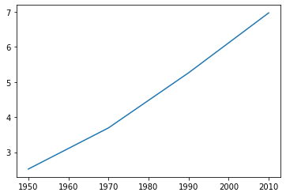
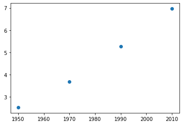
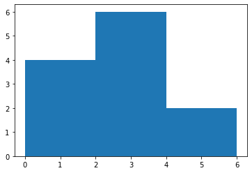
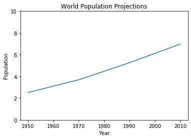
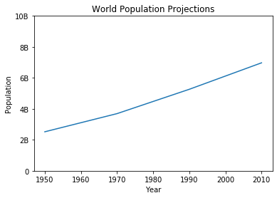
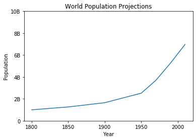

# Matplotlib


```python
import matplotlib.pyplot as plt
```

**Line plot**


```python
year = [1950, 1970, 1990, 2010]
pop = [2.519, 3.692, 5.263, 6.972]
plt.plot(year,pop)
plt.show()
```





**Scatter plot**


```python
plt.scatter(year,pop)
plt.show()
```





**Histogram**


```python
values = [0,0.6,1.4,1.6,2.2,2.5,2.6,3.2,3.5,3.9,4.2,6]
plt.hist(values,bins=3)
plt.show()
```





### Some customization


```python
year = [1950, 1970, 1990, 2010]
pop = [2.519, 3.692, 5.263, 6.972]
plt.plot(year,pop)
plt.xlabel("Year")
plt.ylabel("Population")
plt.title("World Population Projections")
plt.yticks([0, 2, 4, 6, 8, 10])
plt.show()
```





```python
plt.plot(year,pop)
plt.xlabel("Year")
plt.ylabel("Population")
plt.title("World Population Projections")
plt.yticks([0, 2, 4, 6, 8, 10],['0', '2B', '4B', '6B', '8B', '10B'])
plt.show()
```





```python
#Add more data
year = [1800, 1850, 1900] + year
pop = [1.0, 1.262, 1.650] + pop
plt.plot(year,pop)
plt.xlabel("Year")
plt.ylabel("Population")
plt.title("World Population Projections")
plt.yticks([0, 2, 4, 6, 8, 10],['0', '2B', '4B', '6B', '8B', '10B'])
plt.show()
```




